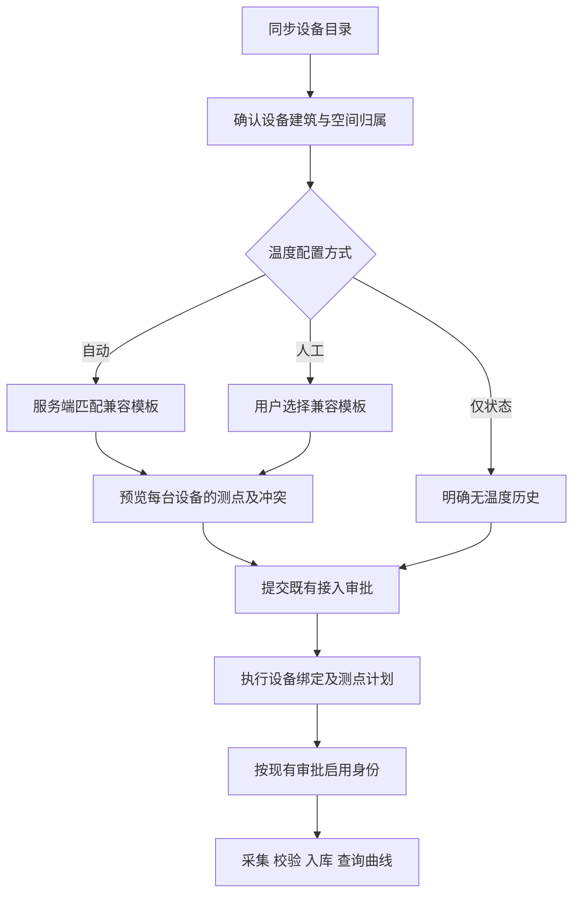

# 空调温度测点自动匹配与人工选模板接入设计及实施计划

> 文档状态：用户已批准实施；实施与验收状态见 `PROJECT_STATUS.md`，本设计本身不代表已部署。
> 已批准方向：自动接入与人工选择模板同时保留，支持后续不同厂家的空调，减少重复操作。
> 用户已明确要求按本计划开始实施，保留现有审批、数据归属及测试环境隔离边界。
> 本文不替代历史设计；既有边界的处理见第 11 节。

## 1. 目标与范围

### 1.1 目标

设备完成接入配置后，系统按照已启用的兼容模板建立温度测点及字段绑定。日常用户不需要逐台选择模板或逐个填写温度测点；遇到特殊设备时，可以主动选择兼容模板或复用已有测点。

必须同时支持：

1. 新设备：默认自动匹配模板，接入审批执行时创建或复用测点。
2. 人工配置：用户切换人工模式，选择兼容模板，必要时调整测点映射。
3. 存量设备：批量预览并补齐缺失测点，不删除设备、不重新发现设备、不覆盖历史数据。
4. 多厂家扩展：匹配、批量任务和审计采用公共机制；字段语义、身份格式和采集方式由厂家适配器负责。
5. 结果可验证：分别显示配置完成、等待采样、采样失败和曲线可用，不能把建点成功当作温度链路成功。

### 1.2 本期交付边界

- 实现公共模板解析与绑定计划机制，首个实际适配对象为大金 API 2.0 室内机。
- 大金默认温度组合为 `roomTemp`（室温）和 `temperature`（设定温度），单位 `°C`，不参与冷站计算。
- 外机按独立能力描述处理；当前大金外机不套用内机双温度模板。
- `arth1`、控制器生命周期状态继续作为参考信息，不自动成为正式室温或故障依据。
- 保留显式“仅接入状态”能力，兼容确实不需要温度历史的设备及旧接口调用。
- 其他厂家本期交付扩展接口与模拟契约验证，不承诺其真实协议、账号或现场已经接通。
- 本期不包含设备控制、远程设温、功率/电量推算、历史温度补造、全项目产品模块重构和大规模采集调优。

## 2. 当前实现与真实缺口

以下结论来自当前代码核对；现有设计描述不能替代当前实现证据。

| 能力 | 当前状态 | 本次需要补齐 |
| --- | --- | --- |
| 产品及测点模板 | 已有 `BizDeviceProduct`、`BizProductPointTemplate` | 复用模板定义，增加自动匹配和冻结的绑定计划 |
| 大金温度模板 | `TypedStateRequest.temperatureTemplates` 已支持可选模板 | 不把“支持配置模板”描述为“已经自动建点” |
| 普通设备自动建点 | `BindRequest.autoCreatePoints` 已存在 | 不能直接认为大金类型化绑定已支持；需要通过公共计划执行接入 |
| 大金类型化绑定 | 已支持显式 `pointBindings`、`numericSourceId`；旧零测点调用有效 | 增加自动/人工/状态模式，保留旧请求语义 |
| 大金批量接入 | 后端已有每批最多 50 台、逐设备幂等审批申请 | 前端当前批量限制零测点产品，需扩展温度计划与逐设备预览 |
| 已绑定设备补点 | 原绑定只接受待处理设备 | 增加独立补齐入口，不调用原绑定入口强行重绑 |
| 温度持久化与曲线 | 已有正式测点、别名、质量校验、TDengine 和查询链路 | 自动准备正确绑定，并验证首批真实数据及曲线 |

当前大金温度写入要求测点与设备、建筑一致，类型为 `AI`、单位为 `°C`、状态为 `ONLINE`，且 `isForCalc=0`。不满足条件时，温度会被标为 `UNCONFIRMED`。本设计补齐配置，不删除这道校验。

代码依据：

- [项目指南：大金接入、审批和温度绑定](../../PROJECT_GUIDE.md)
- [产品及温度模板请求契约](../../src/main/java/com/platform/iot/onboarding/api/DeviceProductContracts.java)
- [产品模板校验](../../src/main/java/com/platform/iot/onboarding/DeviceProductService.java)
- [现有绑定请求契约](../../src/main/java/com/platform/iot/onboarding/api/DeviceOnboardingContracts.java)
- [绑定、建点、别名与归属校验](../../src/main/java/com/platform/iot/onboarding/DeviceOnboardingService.java)
- [运维逐设备审批与批量申请](../../src/main/java/com/platform/iot/onboarding/ScopedDeviceOnboardingService.java)
- [批量接入接口及 50 台限制](../../src/main/java/com/platform/iot/onboarding/api/ScopedDeviceOnboardingController.java)
- [前端批量绑定限制](../../web/src/modules/device-onboarding/models/indoor-batch-binding.ts)
- [绑定表单](../../web/src/modules/device-onboarding/components/BindingDraftDialog.vue)
- [正式温度入库校验](../../src/main/java/com/platform/iot/daikin/monitoring/DaikinTemperatureIngestion.java)

## 3. 统一使用方式

### 3.1 三种配置方式

| 模式 | 页面操作 | 服务端行为 |
| --- | --- | --- |
| 自动匹配（默认） | 显示匹配结果及将创建/复用的测点，无需逐点填写 | 从已启用规则确定唯一模板，生成冻结计划 |
| 人工选择 | 显示兼容模板，允许映射到兼容的已有测点 | 同样生成冻结计划，执行相同归属、单位和冲突校验 |
| 仅接入状态 | 明确显示“不会建立温度历史” | 维持零温度测点接入，不暗中转入自动模式 |

自动与人工是同一功能的两种入口，不维护两套建点逻辑。人工指定优先于自动匹配，但不能绕过兼容性和权限校验。模板匹配失败时显示原因并允许选择兼容模板；不得静默退化成仅状态接入。

新页面默认自动模式；旧 API 省略新字段时保持旧行为，防止升级后旧客户端无意生成大量测点。新页面提交时必须显式传递模式。

### 3.2 新设备正常流程

正常自动匹配不增加模板选择步骤。只有缺少建筑/房间、没有匹配模板、多个匹配、来源未配置或存在冲突时才要求补充配置。自动建点不等于自动通过审批或自动启用身份。

### 3.3 存量设备批量补齐

1. 在已接入设备列表选择设备，执行“配置温度测点”。
2. 服务端读取实际身份、设备和归属，按自动模式逐台匹配；允许统一切换人工模式，但每台都必须兼容。
3. 预览列出“新建、复用、已完整、冲突、缺少配置、不适用”及原因。已有一个温度测点时，仅计划补另一个。
4. 形成逐设备审批申请；审批执行时复核快照，单设备事务内建立测点、别名及绑定记录。
5. 保持现有设备和身份的启停状态。已经启用的设备等待后续采集，停用设备显示“待启用”。
6. 查询首批有效采样与历史结果，按设备返回最终结果。允许只重试失败项。

当前缺少大金温度测点绑定的内机作为首批补齐验收对象。执行前重新查询实际数量；设备数量和测点数量不是永久写死的配置。

## 4. 模板、匹配与多厂家边界

### 4.1 模板复用与版本

- 温度模板复用现有产品测点模板集合，不另造第二套测点名称、单位和质量阈值定义表。
- 计划中的 `templateProductId` 指向模板来源产品；对于存量设备，它不等同于也不自动替换设备当前 `productId`。
- 发布模板继续走产品配置及审批流程。修改发布内容采用复制为新草稿再发布的方式，不在已绑定设备上原地改写。
- 计划冻结模板来源产品 ID、模板条目内容快照、内容摘要及匹配规则版本；执行时重新比对。模板停用或内容变更时，计划失效并要求重新预览。
- 当前零测点产品可保持原样，温度补齐通过附加绑定计划生效；不得为了补温度修改所有存量设备的产品归属。
- 普通用户只使用已启用模板；配置人员负责维护和发布。默认模板及来源关系的一次性设置属于初始化工作，不下放为每台设备的重复操作。

### 4.2 大金默认温度模板内容

| 语义 | 厂家字段 | 单位 | 测点类型 | 用途 |
| --- | --- | --- | --- | --- |
| 室内温度 | `roomTemp` | `°C` | `AI` | 当前温度和历史曲线 |
| 设定温度 | `temperature` | `°C` | `AI` | 当前设定值和历史曲线 |

上述两项均为 `isForCalc=0`。字段暂时为空不能作为“不支持该测点”的唯一证据，是否支持由协议能力描述和已批准模板决定。

质量上下限使用模板中经过确认的参数；不把设定温度 16–32 的范围套到室温，也不根据 R410 等制冷剂名称推断字段语义或单位。缺失值不填零，不添加未经依据确认的默认温度。

### 4.3 自动匹配规则

可信匹配输入包括适配器标识、来源系统、协议/能力版本、身份类型、内外机类型、厂商标识以及可靠型号标识。不能仅凭设备名称包含“大金”“空调”或一次温度值进行匹配。

候选模板首先必须通过适配器兼容性检查，再按以下层级选择：

1. 用户明确选择的兼容模板。
2. 已批准的来源范围专用规则；其中精确型号优先于明确的该来源默认规则。
3. 厂家/协议/设备类型下的精确型号规则。
4. 明确发布的厂家/协议/设备类型默认规则。

在首次命中的层级必须只有一个有效结果；多个结果报冲突，不按数据库第一条、不按不透明分数选择。规则作用域不得越过建筑授权或来源授权；相同匹配键下只能发布一个有效默认规则。

不支持的厂商、协议版本或内外机类型返回“不适用/尚未适配”，仍允许原有状态接入流程。人工选择也不能把不兼容的内机模板强加给外机。

### 4.4 厂家适配器职责

公共服务处理选择、预览、幂等、审批、建点、审计和任务结果；适配器提供：

- 可信设备类型及支持的温度语义。
- 厂家字段到语义的映射、单位依据及必要的已确认转换规则。
- 来源身份和别名构造规则、来源关系校验。
- 已接通的采集及历史存储接入方式。

大金适配器保留 `DAIKIN_V2` 来源命名空间及当前设备身份别名规则。其他厂家可以采用不同字段、单位及来源类型，不强制使用大金 HTTP 来源规则，也不全部写入大金专用表。

多厂家测试必须至少覆盖两个独立能力描述，验证相同字段名不会跨厂家错误匹配；第二个可以是明确标记的测试适配器，不能据此宣称第二家真实设备已接通。

## 5. 建点与绑定计划

### 5.1 服务端生成计划

自动、人工和存量补齐统一进入计划解析器。预览必须返回设备归属、模式、模板及规则版本、数值来源、每项语义和原始字段、拟建/复用测点、冲突、摘要及有效期。

预览只读，不创建测点、占用编号或触发审批；提交后冻结服务端校验的快照，执行不信任前端自行拼接的测点计划。编号使用现有命名规则及唯一性约束，不能直接将房间名当全局测点标识。

### 5.2 复用、冲突与并发

- 唯一逻辑关系是“设备身份 + 温度语义”。同一身份的室温和设定温度是两个测点。
- 复用前核对建筑、设备、来源、原始字段、单位、数值类型及计算用途；仅名称相同不构成可复用依据。
- 已经完整且兼容：返回“已完整”，不重复建点，也不覆盖质量规则。
- 只有部分缺失：只补缺失项。
- 单位、归属、别名目标或用途冲突：整台设备不写入，返回需要处理的冲突，不直接重连到另一设备。
- 对同一设备串行执行，配合唯一约束和稳定幂等键；重复请求返回同一结果。并发自动与人工申请不能各建一套测点。
- 大批次按设备拆分，每设备原子提交；某台失败不回滚其他已成功设备，也不把部分成功显示为整批成功。
- 旧房间归属核对、房间重复选择限制等既有规则保持，本次不借温度模板改动自动放开房间建档规则。

### 5.3 来源、缓存和历史

大金数值来源必须是当前建筑下已启用 HTTP 来源，并具有经配置确认的厂家来源关联。自动模式可复用已批准的唯一来源关系；缺失或歧义时允许按建筑/来源分组配置一次，不从全库随意挑选来源。

MySQL 事务完成后刷新并核验测点运行配置缓存。刷新失败进入可重试状态，不重新创建测点。采集继续经现有检查点、质量校验和不可覆盖入库链路写入 TDengine；绑定事务不与远端采集或 TDengine 写入捆绑成伪跨库事务。

历史曲线从绑定生效且实际成功采样后积累。已保存的历史保留原测点、原时间和原归属；不把当前温度向过去补齐。原始历史回放如有需要另行设计，并验证单位、时间、身份和归属后才能实施。

## 6. 拟新增的数据与接口契约

本节均为拟实施结构，不表示当前仓库已有这些表或接口。迁移版本号以实施时主分支为准。

### 6.1 数据结构

保留现有产品模板、设备、身份、测点、别名和审批表，拟新增以下职责明确的记录：

| 记录 | 主要内容 | 关键约束 |
| --- | --- | --- |
| 温度模板匹配规则 | 适配器/协议/设备类型/型号/来源作用域、模板产品 ID、修订号、状态 | 同匹配键有效规则唯一；启用与变更经过现有配置审批 |
| 温度绑定记录 | 身份、设备、建筑、语义、厂家字段、测点和别名、模板快照摘要、生效时间、审批引用 | 每身份每语义至多一个有效绑定；所有归属由服务端核验 |
| 批量任务 | 提交人、授权范围、幂等键、总数及分类结果 | 不存凭据；跨建筑结果逐项过滤 |
| 批量明细 | 每台设备的冻结计划、审批引用、配置状态、采样状态、脱敏错误及重试信息 | 批次内设备唯一；稳定逐设备幂等键；配置和采集结果分开 |

名称和索引在实现中遵循仓库规范，但不得合并掉版本快照、幂等或权限边界。已有审批表继续是审批状态的权威来源，批量明细只是引用及进度投影，不创建另一套审批状态机。

存量人工别名需要可识别和可复用；预览先校验现有关系，批准后登记对应绑定记录。不能因缺少新表记录就误判为必须新建。

### 6.2 API 及兼容

拟在 `/api/v1/operations/hvac-temperature-bindings` 下提供：

- `POST /preview`：自动或人工解析设备/设备批次，返回逐项计划、快照摘要和阻塞原因。
- `POST /batch-jobs`：提交存量补齐计划，创建逐设备审批申请，返回持久任务 ID。
- `GET /batch-jobs/{jobId}`：返回配置与采样进度，按权限隐藏不可访问的设备。
- `POST /batch-jobs/{jobId}/retry`：仅重试指定可重试失败项；状态已变化时要求重新预览。

新设备继续复用原有接入申请入口，增加可选 `temperatureMode`、`temperatureTemplateProductId` 和计划摘要等增量契约；最终字段定义与 OpenAPI、前端类型和契约测试同步。

- 旧请求未携带新字段：保持原有零测点或显式映射行为。
- 旧 `pointBindings` 与新自动模式冲突时：明确拒绝，不猜测优先级。
- 自动与人工都必须服务端重新核验，不将模板匹配放在浏览器作为权威逻辑。
- 每批保留当前最多 50 台的上限，更大选择由前端分批提交并汇总；不在本期无证据扩大容量。

## 7. 审批、权限与回退

新设备温度计划随现有接入审批提交并冻结，审批通过后才落地。存量补齐增加相应敏感变更处理器，复用提交职责、审核职责和建筑权限。申请与审批之间模板、设备归属、来源或既有绑定发生变化时，返回计划过期，不按新内容静默执行。

自动模式减少重复配置，不取消既有审批，不自动开启采集开关，不修改身份启停规则。采集服务不得收到一条温度报文就直接创建正式测点。

失败及回退要求：

- 单台配置事务失败：该台新增测点、别名、绑定记录一起回滚。
- 任务重试：复用已成功结果，仅处理可重试明细。
- 已产生历史后的回退：通过审批停用本次新增关系，保留历史、审计和旧关系，不物理删除历史测点。
- 不自动停用人工复用的共享测点；错误绑定的修正单独审批，不能直接将历史迁到新设备。
- 发布回退须核对新绑定能否被旧版本读取；数据库结构采用兼容增量，不能用代码回退假定业务配置也已回退。

## 8. 页面结果与异常提示

配置结果与采样结果分别显示：

| 类型 | 状态示例 | 用户应看到的内容 |
| --- | --- | --- |
| 预览 | 将新建、将复用、已完整、需配置、不适用 | 模板、来源、测点和具体原因 |
| 审批/执行 | 待审核、执行中、配置完成、部分失败、计划过期 | 逐设备结果及可执行操作 |
| 数据 | 待启用、等待采样、有效采样、厂家未返回、存储失败、质量屏蔽 | 区分配置、通信、数据和质量问题 |

自动匹配成功时默认收起高级配置，显示“将自动建立室温、设定温度测点”。人工模式展示兼容模板和已有测点选择。

缺少正式绑定时显示“尚未配置温度测点”及有权限的配置入口；不再让用户把它理解为厂家温度字段语义未知。保留原有 `UNCONFIRMED` 的后端兼容性时，新增可解释原因或查询侧原因，不能仅在前端凭空推断。

曲线无数据时区分未绑定、未启用、等待首次采样、厂家空值、存储失败和质量不允许使用。成功标准不是曲线组件能够打开，而是查询到了实际采集的时间和值。

## 9. 实施步骤与阶段交付

| 阶段 | 工作 | 可检查的交付物 | 下一阶段条件 |
| --- | --- | --- | --- |
| 0 设计确认 | 确认模式、模板复用、存量补齐、审批及多厂家边界 | 本设计计划书 | 详细设计获确认 |
| 1 契约与模板解析 | 能力描述、规则、快照、兼容性和预览；大金适配实现 | 增量契约、迁移及解析测试 | 自动/人工选中相同模板产生等价计划；不写业务测点 |
| 2 新设备接入 | 在原审批执行中应用计划，幂等建点/复用，兼容旧请求 | 后端绑定链路及回归测试 | 零点旧流程和普通数值设备均无回归 |
| 3 存量批量补齐 | 持久任务、逐设备审批、部分失败重试、来源配置和缓存刷新 | 存量补齐 API、并发及权限测试 | 重复执行不重复建点，既有身份与历史不变 |
| 4 页面流程 | 默认自动、人工切换、预览、批量结果和采样原因 | 页面、生成类型与前端测试 | 自动路径不要求逐台填温度测点 |
| 5 隔离验收与部署 | 完整软件检查、测试环境补齐、实际温度和曲线核对 | PR 验证记录及逐设备验收结果 | 配置、持久化和查询均通过，不遗留未报告失败项 |

阶段可使用同一功能任务连续推进，但应按可审查边界拆分提交或 PR；不得在字段展示修复 PR 中混入本功能。各阶段完成不自动意味着功能全部完成，未通过阶段 5 不宣称真实温度链路闭环。

## 10. 验收标准

### 10.1 必须覆盖的自动化场景

1. 唯一规则时自动选中兼容模板；人工选择相同模板得到相同测点计划。
2. 来源专用、精确型号、默认规则的优先级确定；同层多匹配返回冲突。
3. 新厂家/未知协议、外机、不同单位不误套大金内机模板。
4. 人工模式不能跨建筑、跨设备或跨厂家绑定不兼容测点。
5. 模板或来源停用、归属变更、内容摘要变化使原计划失效。
6. 新内机自动建两个测点；重复提交、审批重试及并发执行不重复建点。
7. 存量零点设备补齐；已有一个点只补另一个；已有两点返回已完整。
8. 存量人工绑定正确时复用；错误单位或别名冲突时不覆盖、不部分落地。
9. 单台失败不影响其他设备，批次准确报告部分成功；重试仅处理失败项。
10. 旧省略模式请求、仅状态产品和普通数值设备接入保持兼容。
11. 配置提交后缓存刷新失败可重试，不把未加载配置显示为可采样。
12. TDengine 失败、厂家空值、质量屏蔽均保留真实原因，不生成零温度或假历史。
13. 批量任务查询和重试遵守当前建筑权限，不能通过任务 ID 读取其他建筑数据。
14. 多厂家测试适配器验证语义隔离，并明确不代表新增厂家现场验收。

按仓库验证矩阵执行定向检查、后端全量测试、前端测试/lint/类型检查/构建；涉及数据库迁移、事务和审批的部分执行相应隔离集成验证。普通自动化不得连接现场设备。

### 10.2 测试环境实测

- 先查询当前设备、身份、正式测点及别名，生成补齐预览。若仍为 14 台且每台缺两个温度点，预期新增 28 个；实际数量按预览核定。
- 选一台新接入测试对象验证自动流程，再对授权范围内存量设备分批补齐；不能为测试而删除真实设备。
- 每台室温和设定温度分别取得至少两个不同采集时刻的有效值，核对字段、设备、单位、时间及历史查询一致。
- 验证室温与设定温度分别入库且不混用；`arth1` 不替代室温。
- 验证重复补齐结果为已完整，测点和别名数量不增加；既有运行统计及状态监测继续正常。
- 新版本仅部署到本项目测试入口，核对路由及 MySQL/TDengine/Redis 隔离，不变更其他应用入口。
- 实际页面确认当前温度和曲线可见，缺口不插值；没有数据的设备逐台说明原因，不能全部标成成功。

## 11. 既有硬约束处理

| 既有边界 | 本设计处理 |
| --- | --- |
| 只读监测，不控制空调 | 保留；自动建点不调用任何控制接口 |
| 建筑、空间、设备归属及权限 | 保留；服务端验证，模板不决定设备归属 |
| 模板发布、接入及身份启用审批 | 保留；计划嵌入现有审批，补齐使用相同治理机制 |
| 已绑定零点产品不静默升级 | 保留；通过可预览、可审批的补齐动作建立关系 |
| 既有已用产品与模板不可随意改写 | 保留；模板快照与复制发布，存量补齐不改设备产品归属 |
| 温度必须经正式测点、质量校验和存储 | 保留；自动化负责准备配置，不绕过持久化链路 |
| 旧 API 可选字段与零点兼容 | 保留；新页面显式选择自动，旧请求保持原意 |
| 后续多厂家能力 | 扩展设计；首期仅大金真实落地，其余厂商需各自适配与验收 |
| 空值、未知、参考解释及完整历史 | 保留区别；参考字段不成为正式测量事实，不补造过去曲线 |

## 12. 设计完成与启动实施的判定

第 1、3、4、7 节目标和边界已经用户确认，可进入实施。需要新增的权限、契约和数据结构属于本功能的一部分，须与设计一致；实施中若发现必须改变审批、存量产品归属或质量门禁，应先说明差异并修订设计，不能自行扩大范围。

本设计交付不改变当前温度测点，不修改测试服务器，不承诺任何尚未发生的真实采样结果。
