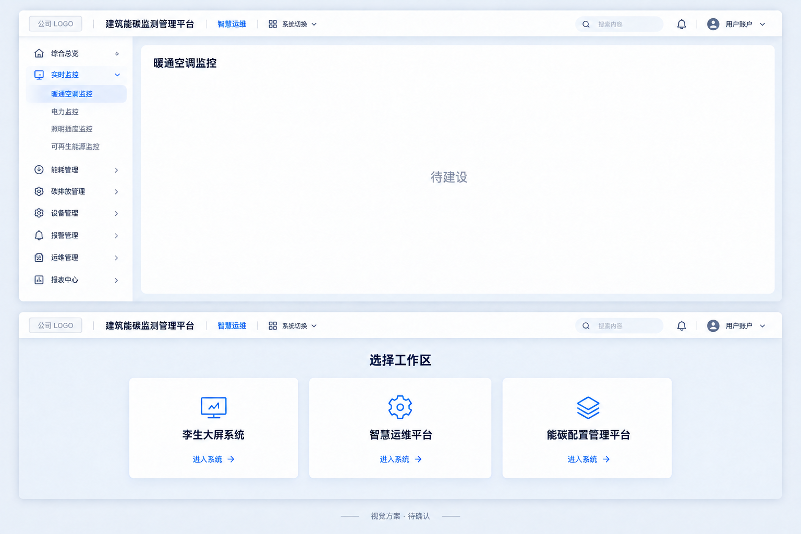

# 第二阶段前端可视化实施计划

## 1. 文档状态与边界

本文记录第二阶段前端可视化的当前执行基线。当前公共骨架已有候选代码，
实际完成状态以 [PROJECT_STATUS.md](../../PROJECT_STATUS.md) 为准，不再以原计划推断尚未编码。

第 2—14 章为当前范围及公共工程规则，第 15 章为三系统改造、菜单和分阶段交付方案。
本文按用户明确要求统一整理，不再保留并行生效的旧条款；历史版本由 Git 保存，
第 15.2 节保留已批准约束的演进关系。不得把该表中的历史表述当作当前执行要求。
三系统职责、菜单、导航与占位规则已经用户确认；公共骨架已有实现候选，业务迁移与唯一入口退出旧资产仍待实施，完成与验收状态以项目状态文档为准。场景型布局按本次确认同步补充至第 11 章。

本文只记录已经确认的内容，不补充未讨论的页面结构、指标字段、接口路径、角色权限、时间计划、
负责人、公司视觉标识或业务规则。后续实现遇到未确认事项时，应先完成对应讨论，不得由软件或
开发人员自行猜测。

本文参考《附件4 信息系统用户界面设计规范（征求意见稿）》的桌面端布局、组件、字体和样式
标准，不读取、不采用其中的移动端规范；规范中的颜色主题、公司标志和示例业务内容不直接照搬。

## 2. 已确认的产品范围

### 2.1 使用者与终端

- 使用者按运维维护、能碳配置管理职责组织，具体账号角色授权不预设；
- 主要终端为普通办公电脑和 1920×1080 监控大屏；
- 桌面端需要兼容 1366×768、1440×900、1920×1080 及以上的 16:9 显示区域；
- 孪生大屏、智慧运维、能碳配置为同一前端工程的三个工作区；两个管理平台共享后台外壳，
  孪生大屏使用独立大屏外壳，共享接口、设计 Token、多语言和基础组件；
- 办公端承担管理、查询、下钻和业务操作，监控端以全屏展示和轻交互为主，不承担编辑、配置和
  业务处理；
- 当前不设计移动端，也不引入移动端适配和组件库。

### 2.2 首批页面范围

两个管理平台的一、二级菜单以第 15.4 节为完整清单。第一版骨架提供所有已确认菜单的授权导航与
可点击页面；未建设业务使用名称和“待建设”占位。核心看板、对象下钻和趋势分析是页面能力，
不再作为仅有的三个办公菜单。已有业务迁移与新业务页面建设按第 15.8 节分开验收。

孪生大屏第一版保留以下五类并列展示主题及独立页面地址：

1. 监控大屏；
2. 趋势大屏；
3. 态势大屏；
4. 状态大屏；
5. 分析大屏。

五类不是下钻层级。已确认的综合监控内容见第 2.4 节，其余专题内容和未确认业务细节不得预设。
后续新增大屏接入统一骨架，不重复建立外壳、导航、缩放和基础状态处理。

### 2.3 业务权威边界

- 后端负责权威业务逻辑、指标计算、质量判定、权限和建筑范围；
- 前端负责页面展示、状态编排、交互和视图映射；
- 前端不得生成随机业务数据、虚假历史或在浏览器中重新计算后端指标；
- 前端不得因画布或页面调整而改变业务事实；
- 新页面只消费后端公开契约，不直接依赖后端内部表或内部实现。

### 2.4 综合监控已确认内容与未定边界

下列为综合监控页面已经确认的需求，不表示业务或三维代码已经完成，也不要求本轮骨架填入数据。

| 区域 | 已确认内容 |
|---|---|
| 关键指标 | 年累计、当日累计同时展示碳排总量与单位面积碳排强度；当日为零点至当前时刻，面积分母为整栋试点建筑总建筑面积 |
| 左侧：排放构成 | 范围一/范围二切换、按能源类型展示；范围一仅固定源，不含移动源；范围二包含外购电力与热力 |
| 左侧：能源流向 | 能源类型至设备功能的桑基图，显示总量；折标与碳排展示切换 |
| 左侧：功能占比 | 展示空调、照明等功能的碳排百分比分布，具体类别依据实际数据 |
| 右侧：对比趋势 | 同比/环比采用按能源类型堆叠柱状图；碳排实际线、基准线与环境温度展示；独立预测图呈现实测线和预测线 |
| 右侧：报警信息 | 分类与列表展示，设备掉线、能耗超标是已讨论示例；不扩展自动工单、处置闭环或 AI 分析 |
| 右侧：设备排名 | 碳排强度高、能效低两类排名展示；专业适用性、计算及排序结果由后端提供 |
| 两侧面板 | 左右独立隐藏/展开、半透明表面；恢复入口可用，文字不随背景变透明；收起不改变中央场景画布，重新展开保留当前页内标签 |
| 中央区域 | 试点建筑三维展示；期望点击楼层或机组进入相应层级并联动两侧数据，是否第一版实现取决于资料与工作量 |

中央场景、面板层与导航层需要骨架预留清晰边界。楼层和机组不默认组成单一物理树，
不能为展示效果伪造对象关系。具体模型、渲染库、预测方法、预测跨度、基准来源、刷新频率、
时间筛选及跨主题时间/对象继承仍未确定。预测展示需求不授权前端生成预测数据。

## 3. 视觉方向

本章及后续公共规则与第 15 章共同适用，不以参考模板的功能代替已确认需求。

### 3.1 新旧界面关系

- 原有深色 HVAC 页面的全部视觉设定和样式不作为新前端基线；
- 可以核对和复用已有真实业务内容与数据能力，但不延续旧页面的颜色、布局和装饰方式；
- 新前端独立建立目录、组件、样式、Token、多语言和主题体系。

### 3.2 视觉参考与限制

- 当前视觉方向参考博锐尚格、禹数、MEOS数字等同类头部产品的成熟企业界面表达；
- 参考只用于判断信息层级、专业感、密度和完成度，不复制其品牌、页面和内容；
- 默认方向为浅色、清晰、克制的企业管理界面；
- 不使用大面积霓虹光效、发光描边、地图底座式驾驶舱、伪三维装饰和无业务意义的高密度科技元素；
- 地图与微前端不在本轮范围；试点建筑三维展示需求已确认，BIM/WebGL 等技术选型尚未确定，
  本轮骨架仅预留场景及联动边界，不引入未经确认的三维技术依赖；
- 公司标志和公司视觉识别等待正式素材，不使用国网标志，也不自行设计或猜测公司标志。

## 4. 前端技术基线

### 4.1 框架与基础库

已确认采用：

- Vue 3；
- TypeScript；
- Composition API；
- `<script setup>`；
- Vite；
- Vue Router；
- Pinia；
- Axios。

实现必须遵守 Vue、Vite、Vue Router、Pinia 和 TypeScript 的官方规范，不绕开框架生命周期、
响应式系统、路由和状态管理机制自行建立重复方案。

### 4.2 界面与可视化库

已确认采用：

- Element Plus：主要界面组件库；
- ECharts：图表和趋势可视化；
- Lucide Vue Next：统一图标来源；
- Vitest 与 Vue Test Utils：前端测试。

依赖的准确版本在开始编码时根据兼容性统一锁定；本文不提前填写未经验证的版本号。

### 4.3 复用优先级

实现界面时按以下顺序选择：

1. Element Plus 官方组件；
2. 项目级共享组件；
3. 当前业务模块组件；
4. 扩展已有组件；
5. 新建组件。

不得绕开 Element Plus 重复手写按钮、输入框、表格、弹窗、提示框和基础导航控件。项目组件
必须增加明确的项目语义、行为或组合价值；仅透传全部属性的空壳组件不得创建。

## 5. 目录边界

前端目录按应用装配、业务与展示聚合模块、共享能力、基础设施、生成契约和全局样式分层：

```text
web/src/
├─ app/                  # 应用入口、路由装配和全局提供者
├─ modules/              # 按业务能力划分的模块
├─ shared/               # 跨模块共享组件、组合函数、模型和工具
├─ infrastructure/       # HTTP、实时连接等技术基础设施
├─ generated/            # 由契约生成的类型或客户端
├─ locales/              # 全局多语言资源与注册入口
└─ styles/               # 全局样式、Token、主题和组件库适配
```

目录职责固定如下：

| 内容 | 放置位置 | 规则 |
|---|---|---|
| 页面 | `modules/<module>/pages` | 只承载当前模块页面编排 |
| 模块组件 | `modules/<module>/components` | 只服务当前模块 |
| 共享组件 | `shared/components` | 至少具有稳定跨模块复用价值 |
| 模块请求 | `modules/<module>/api` | 只访问当前模块公开接口 |
| HTTP 基础设施 | `infrastructure/http` | 只处理客户端、拦截器和通用传输行为 |
| 模块工具 | 模块内部 | 不提前提升为全局工具 |
| 共享工具 | `shared/utils` | 无业务归属且确实被多个模块复用 |
| 全局样式 | `styles` | Token、主题、基础样式和组件库适配 |
| 页面局部样式 | 对应 Vue 文件的 `scoped` 样式 | 不污染全局选择器 |

全局样式不得出现具体页面选择器。不得在多个页面大范围覆盖 Element Plus 内部类名。

应用层沿用两种外壳模式，管理外壳服务两个工作区：

```text
app/
├─ layouts/
│  ├─ office/            # 智慧运维和能碳配置共用的管理外壳
│  └─ monitor/           # 监控端公共大屏外壳
└─ router/               # 登录、系统选择、三工作区及两种外壳的路由装配
```

`app` 只负责页面外壳、路由装配和全局提供者，不放具体办公页面、大屏内容或业务请求。

## 6. 模块边界

已确认的前端模块边界为：

```text
modules/
├─ auth/
├─ dashboard/
├─ drilldown/
├─ trend-analysis/
├─ large-screen/
├─ access-control/
├─ asset-management/
└─ device-onboarding/
```

每个模块按需要使用以下内部结构：

```text
<module>/
├─ pages/
├─ components/
├─ composables/
├─ api/
├─ models/
├─ mappers/
├─ stores/
├─ locales/
├─ routes.ts
└─ public.ts
```

边界规则：

- 模块内部实现不得被其他模块直接导入；
- 跨模块只能通过 `public.ts` 暴露的稳定入口协作；
- 应用层负责组合模块路由和全局提供者；
- 模块只能依赖共享层、基础设施层和生成契约，不反向依赖应用层；
- 前端不建立表达权威业务规则的 `domain` 目录，页面模型使用 `models`，接口到页面的转换使用
  `mappers`；
- `access-control`、`asset-management` 和 `device-onboarding` 承接已确认的权限、资产和设备接入能力；
  菜单归属按第 15.4 节，迁移按第 15.8 节执行。不得按一级菜单复制业务模块或扩大未确认业务。

`large-screen` 是监控端展示聚合模块，内部边界固定为：

```text
large-screen/
├─ pages/
│  ├─ monitoring/
│  ├─ trend/
│  ├─ situation/
│  ├─ status/
│  └─ analysis/
├─ components/
├─ registry/
├─ locales/
├─ routes.ts
└─ public.ts
```

- 每张大屏拥有独立页面目录和独立访问地址，通过统一注册信息接入路由与导航；
- `large-screen` 不直接导入其他业务模块内部文件，只能通过对应模块的 `public.ts` 使用稳定能力；
- 监控端公共外壳不请求具体业务数据；
- 大屏专用组件保留在 `large-screen/components`；只有同时被办公端和监控端稳定复用的组件，
  才能提升到 `shared/components`。

## 7. 组件复用规则

### 7.1 第三次出现即抽象

同类界面结构在项目中出现第三次时，必须优先抽象为可复用组件，不允许复制粘贴形成第三份实现。

判断时同时考虑：

- 视觉结构相似；
- 交互行为相似；
- 输入输出能够形成稳定接口；
- 抽象后不会把不同业务语义强行混合。

### 7.2 组件归属

- 只在单个页面使用：保留为页面局部结构；
- 在同一模块多次使用：放入模块组件；
- 跨模块稳定复用：提升为共享组件；
- Element Plus 已经提供：优先直接使用或进行有项目语义的组合封装。

### 7.3 大屏组件层次

大屏组件按以下三层组织：

1. 基础组件层：Element Plus、项目通用组件、图标、按钮、提示和状态组件，办公端与监控端共同
   复用；
2. 大屏公共组件层：大屏顶栏、分组导航面板、画布缩放容器、内容面板、指标卡、状态卡，以及
   加载、空数据和错误状态；
3. 具体大屏组件层：只服务当前大屏页面的可视化和内容编排。

具体大屏不得修改或复制公共外壳。第一版先提供网格、内容面板、指标卡和图表容器等布局积木，
不预设五套固定整页模板；同类整页结构实际出现第三次时，再按本章规则抽象为页面模板。

### 7.4 统一图表容器

ECharts 的主题、字体、颜色、缩放、窗口变化、加载状态、空数据和销毁行为由公共图表容器负责。
各大屏只提供经过确认的数据和图表配置，不重复编写图表生命周期处理。

## 8. 样式系统与设计 Token

### 8.1 单一来源

设计 Token 统一采用 CSS Custom Properties，项目前缀为 `--bec-`。除 Token 定义文件外，页面、
组件和图表配置不得散落硬编码颜色、字号、间距、圆角和阴影。

```text
styles/
├─ index.css
├─ base/
│  ├─ reset.css
│  ├─ typography.css
│  └─ accessibility.css
├─ tokens/
│  ├─ reference.css
│  ├─ semantic.css
│  └─ component.css
├─ themes/
├─ element-plus/
│  └─ adapter.css
└─ utilities/
   └─ layout.css
```

Token 分层：

1. `reference.css` 保存原始色阶和尺寸值，是集中出现原始颜色、尺寸和阴影参数的位置；
2. `semantic.css` 保存页面和组件使用的语义角色；
3. `component.css` 只保存稳定组件的专属映射；
4. 主题文件映射语义颜色；
5. Element Plus 适配文件将项目 Token 映射到官方 `--el-*` 变量。

### 8.2 字体与尺寸

- 中文字体：微软雅黑；
- 英文字体：Arial；
- 数字字体：优先 DINPro，资源未提供时沿用 Arial、微软雅黑及 sans-serif 回退；
- 默认行高：字号的 1.5 倍；
- 字号尺度：12、14、16、18、20、24、28、40、44px；其中 18px 用于管理端页面／卡片标题及已确认的大屏适配；
- 办公端字号与字重执行下表；中文和英文字体族保持原配置；
- 图标尺度：16、24、48px；
- 间距尺度：0、4、8、12、16、20、24、32、40、48、64px；
- 主间距节奏：16px；
- 圆角尺度：0、2、4、8、999px；
- 控件圆角 2px、卡片圆角 4px、弹窗圆角 8px；胶囊圆角只用于标签和状态；
- 阴影只使用 `none`、`card`、`raised`、`overlay`、`focus` 五个等级。

用户已批准以以下层级替代原办公端字号映射，适用于智慧运维、能碳配置管理端及系统选择页。
这是项目级的明确适配，不改变登录页和孪生大屏的字号要求，也不授权业务页面自行缩小文字。

| 位置 | 字号 | 字重 |
|---|---|---|
| 顶栏平台名称 | 20px | 400 |
| 顶栏当前系统标签 | 16px | 400 |
| 一级菜单 | 16px | 400，当前叶子的父分组为 600 |
| 二级菜单 | 14px | 400，当前叶子为 600 |
| 管理端页面标题 | 18px | 600 |
| 正文和辅助文字 | 14px | 400 |
| 系统选择页“选择工作区”标题 | 24px | 600 |
| 系统选择页卡片名称 | 18px | 600 |

一级菜单行高保留 48px，二级菜单行高保留 40px；字号缩小不压缩现有点击区域。
管理端菜单、页面标题、卡片标题和顶栏平台名称使用各自的组件级 Token，
继续引用统一原始字号尺度，避免改变共享字号变量后影响其他页面模式。

监控端为大屏标题、面板标题、关键数字、正文、辅助文字、画布间距和面板间距建立独立语义
Token，但底层继续引用本节统一的字号和间距尺度，不建立第二套原始变量。监控端不直接套用
办公端字号层级。监控端预览候选为主标题 40px、面板标题 28px、关键数字 44px、正文/状态 20px、
辅助文字/坐标/图例 18px、顶栏左右留白 32px、面板间距 16px。主标题、面板标题、顶栏留白和
面板间距依据桌面监测展示规范，其余为项目适配。经实际观看距离可读性检查后冻结，
页面不得自行缩小字体以容纳内容。

### 8.3 硬编码限制

- ECharts 不得直接填写颜色，必须读取同一套语义 Token；
- TypeScript 不得复制另一套颜色常量；
- Element Plus 只通过统一适配层覆盖；
- 允许使用 `0`、`auto`、百分比、`fr`、`currentColor` 和基于 Token 的 `calc()`；
- SVG 路径坐标、数据计算尺寸和图片自身颜色不属于界面设计值硬编码；
- 复用已有静态检查，并按本轮新增的外壳和导航规则补充检查；静态检查不能替代语义与视觉验收。

监控端文字、单位、数字和状态使用统一格式与溢出规则。关键状态不得只显示颜色，也不得通过
省略号隐藏；内容过多时减少展示项或重新编排页面，不能压缩字号、挤出画布或产生滚动。

## 9. 多语言规范

### 9.1 第一版范围

- 第一版只交付简体中文 `zh-CN`；
- 第一版不提供语言切换入口；
- 暂不创建内容不完整的英文翻译文件；
- 页面从一开始使用统一文案入口，后续增加英文时不重写页面结构；
- Element Plus 统一使用简体中文语言包。

### 9.2 文案目录

```text
locales/
├─ index.ts
└─ zh-CN/
   ├─ common.ts
   ├─ navigation.ts
   ├─ validation.ts
   ├─ error.ts
   └─ terminology.ts
```

业务模块自己的文案放入 `modules/<module>/locales/zh-CN.ts`，由统一注册入口组合。不得把全部
业务文案堆进单一文件，也不得在页面、组件、图表、校验器和错误处理器中直接写用户可见文案。

### 9.3 中文界面要求

- 按钮、页面标题、菜单、面包屑、表格列名、提示、校验、错误、空状态、加载状态和无障碍标签
  统一管理；
- 第一版界面不出现面向开发人员的英文代码术语、代码字段、异常堆栈、数据库名称和内部接口名；
- 后端错误通过稳定错误标识映射为中文提示，不直接显示异常原文；
- 国际标准计量单位、设备型号和依法需要展示的品牌名称不属于代码术语；
- 日期、时间、数字和单位通过统一格式化函数输出；
- 禁止用字符串拼接构造完整句子；
- 术语表统一同一业务概念的中文名称；
- 布局预留后续英文文案增长空间。

## 10. 主题规则

### 10.1 默认主题

第一版只启用 `office-light`：浅色、清晰、克制的企业管理主题。默认主色为 `#2563EB`，用于
主要按钮、选中状态、链接、焦点和当前导航，不用于无意义装饰。

| 角色 | 基准颜色 |
|---|---|
| 页面背景 | `#F4F7FA` |
| 默认表面 | `#FFFFFF` |
| 次级表面 | `#F8FAFC` |
| 主要文字 | `#172033` |
| 次要文字 | `#526071` |
| 禁用文字 | `#98A2B3` |
| 默认边框 | `#D8E1EB` |
| 分割线 | `#E8EDF3` |
| 主要操作 | `#2563EB` |
| 悬浮操作 | `#1D4ED8` |
| 按下操作 | `#1E40AF` |
| 主色浅背景 | `#EFF6FF` |
| 成功 | `#16875D` |
| 警告 | `#B76E00` |
| 错误 | `#C43D4B` |

上述原始颜色只允许出现在主题或基础 Token 文件中。

### 10.2 品牌色与操作色

品牌色和操作色使用不同语义角色：

```text
--bec-color-brand-primary
--bec-color-action-primary
```

当前可以映射为同一蓝色。公司正式视觉识别到位后，品牌区域使用公司品牌色；如果品牌色不满足
界面可读性要求，操作色不跟随强制变更。

### 10.3 主题扩展

```text
themes/
├─ office-light.css
├─ monitor-dark.css
└─ index.css
```

- `office-light.css` 为第一版办公端与监控端共同启用的正式主题；
- `monitor-dark.css` 只预留扩展位置，具体颜色尚未确认，不得写成已完成；
- 主题由根节点 `data-theme` 统一控制；
- 第一版只有一个主题，因此不显示主题切换入口；
- 新主题必须完整映射全部语义颜色，不得在页面中增加主题判断；
- 暗色主题需要独立设计表面层级，不能机械反转浅色主题；
- 主题只改变颜色和阴影，不改变布局、字号、间距、圆角、组件行为和业务逻辑；
- 监控大屏布局属于页面模式，不等于深色主题。

### 10.4 颜色语义

- 主色只用于操作、选中、链接和焦点；
- 中性色用于文字、背景、边框和分割线；
- 成功、警告、错误色只表达对应状态；
- 图表使用独立的统一色板，不在单张图表中自行选色；
- 数据质量颜色按质量等级保持固定含义；
- 状态和告警必须同时使用文字、图标或位置，不只依赖颜色；
- 禁止霓虹发光边框、大面积装饰渐变和无业务意义的高饱和色。

## 11. 监控端大屏骨架

### 11.1 页面模式与公共外壳

监控端以 1920×1080 浏览器全屏、单屏不滚动为强制设计基准，主要用于远距离查看。所有大屏
共享同一公共外壳，顶部固定包含：

- 公司标志；
- 系统名称；
- 当前大屏名称；
- 当前时间；
- 大屏切换入口；
- 全屏按钮；
- 系统切换入口；
- 对象返回上一级入口，与大屏主题切换分开；具体父级与无父级状态按下钻设计确定。

公司标志在正式素材到位前只保留中性占位，不自行设计。公共顶栏不显示管理员头像和复杂操作。
监控端允许页面切换、对象下钻、图表提示和已确认时间范围等轻交互，不承担编辑、配置和业务处理。

顶栏采用品牌及系统名称居左、当前大屏标题在画布中线居中、时间及操作居右的结构。
大屏切换、全屏和对象返回可使用带中文可访问名称及悬停说明的图标按钮，系统切换保留明确入口；
不得为匹配原型而删除导航，或把对象下钻混为大屏切换。无父级时返回入口禁用。

### 11.2 大屏注册与导航

每张大屏只登记一次名称、所属分组、独立访问地址、显示顺序和页面入口。路由和导航必须从同一份
注册信息生成，不得分别维护两套清单。新增一张大屏时，只增加对应页面目录和一条注册信息，不得
修改其他大屏页面或复制公共外壳。

大屏数量会持续增加，因此顶部不横向平铺全部页面名称。统一通过大屏切换入口打开分组导航面板，
再进入具有独立访问地址的目标大屏。

第一版只提供人工切换，不实现自动轮播、轮播按钮、定时器或空实现。注册信息保留分组和顺序，
作为后续扩展自动轮播的接入边界；是否启用、切换间隔和运行规则必须另行确认。

### 11.3 逻辑画布与布局

- 使用 1920×1080 逻辑画布，根据实际可视区域等比例缩放并居中；
- 禁止横向或纵向单独拉伸，不裁切内容，不因分辨率改变页面结构；
- 其他 16:9 显示区域按同一逻辑画布等比例适配；非 16:9 窗口保留安全留白；
- 公共顶栏和内容安全区位置统一；普通图表型大屏继续使用网格布局，场景型大屏使用下述可复用场景布局；
- 不允许每张大屏大量使用随意的绝对定位；超出单屏的内容必须重新编排，不能产生滚动；
- 导航面板、下拉框、提示框和图表提示位于同一缩放画布体系内，避免缩放后位置错乱；
- 图表尺寸变化由公共图表容器统一处理，页面不得分别监听窗口变化。

#### 场景型大屏的区域与交互边界

监控大屏采用“场景底层＋顶部指标区＋左右悬浮信息面板”。这是同一公共大屏底座上的可选布局，
不是第三套应用外壳，不强迫趋势、态势、状态和分析大屏都围绕建筑场景组织内容。
大屏注册信息声明场景或普通网格模式；公共外壳据此设置内容安全区，不判断具体业务指标。

- 场景层覆盖顶栏以下完整内容区域，预留图片或三维内容插槽；不从截图裁取建筑素材，不生成假建筑模型。
- 顶部、左侧、右侧通过插槽承载页面内容；未提供的区域不保留空面板和收起按钮。
- 两侧面板独立展开与收起，按钮始终可找回；收起隐藏内容及其焦点目标，不销毁已挂载的场景，也不改变场景尺寸、相机或缩放。
- 面板背景为半透明表面，文字和图表不整体降低透明度。半透明仍会遮挡场景，收起能力不可省略。
- 信息层空白不拦截场景指针事件，实际面板与按钮正常接收交互；后续三维拾取、旋转及缩放由场景组件实现。
- 场景、信息、公共导航与异常提示分层；导航及弹窗仍在同一逻辑画布内。全局异常提示不重新挤压场景区域。
- 收起控制支持键盘及中文可访问名称，暴露展开状态和关联面板；骨架不自行持久化面板偏好，离开页面后重新进入恢复默认展开。
- 面板不产生独立滚动来绕开单屏要求；具体业务内容接入时须按统一字号、容量重新编排，不能靠缩小字体或隐藏溢出来塞满内容。

初始工程适配变量：顶栏高 80px、两侧各宽 368px、顶部信息区高 96px、面板表面不透明度 88%，
均统一进入设计变量；间距继续沿用 16px、顶栏左右留白 32px。新增尺寸是项目布局候选，
不是规范原文规定，须在真实内容及观看条件下复核。未接入业务时，仅展示区域名称与“待建设”，
不将原型示意数值、能源结构、预测曲线或报警写入公共组件。

### 11.4 状态与运行生命周期

公共外壳负责整页加载失败、无访问权限、页面不存在和全局连接异常。具体大屏负责自身模块的加载、
空数据和局部错误；单个图表或组件失败不得拖垮整张大屏，也不得影响其他大屏。

各大屏按独立访问地址延迟加载，只加载当前页面。进入页面时启动数据获取和必要监听；离开页面时
停止定时请求、实时订阅和观察器，并销毁图表，禁止切换后继续在后台运行。

### 11.5 数据接入与刷新

- 后端继续负责指标计算、状态判断、告警等级、统计口径、权限和建筑范围；
- 大屏前端只负责查询、格式转换、状态编排和展示，不重新计算权威业务结果；
- `large-screen` 只能通过业务模块公开入口使用数据能力，公共大屏外壳不请求具体业务数据；
- 大屏骨架允许普通查询、定时刷新和实时推送，但不设置统一刷新频率；
- 每张大屏根据已经确认的后端契约选择数据方式，并统一展示数据更新时间、加载状态和数据失效
  状态；具体刷新间隔不得由前端自行猜测。

## 12. 公共工程能力清单

以下为公共工程能力清单，已有实现先复用并核对，不从零重建。三系统本轮具体执行顺序与
阶段验收以第 15.8 节为唯一顺序，不将本章能力清单解释为重复建设任务。

### 12.1 前端骨架能力

1. 根据兼容性锁定已确认框架和组件库版本；
2. 建立 `app`、`modules`、`shared`、`infrastructure`、`generated`、`locales` 和 `styles` 边界；
3. 建立应用入口、路由装配和全局提供者；
4. 建立 Element Plus、ECharts 和 Lucide 的统一入口；
5. 完善两个管理平台共享外壳与独立监控外壳；
6. 建立监控端逻辑画布、统一注册、分组导航和页面级状态边界；
7. 不复用原有深色 HVAC 样式作为新骨架依赖。

### 12.2 样式、多语言和主题基础

1. 建立三层设计 Token；
2. 建立基础样式、可访问性样式和布局工具；
3. 建立 Element Plus Token 适配；
4. 建立简体中文文案注册和模块文案边界；
5. 建立 `office-light` 默认主题和主题注册入口；
6. 建立 ECharts 读取语义 Token 的统一方式；
7. 建立大屏语义 Token、统一图表容器和画布内浮层规则；
8. 增加硬编码样式和用户可见文案的检查。

### 12.3 模块壳层

1. 建立已确认模块目录和公开入口；
2. 由应用层统一装配模块路由；
3. 验证模块不能跨目录导入内部实现；
4. 建立共享组件和模块组件的归属规则；
5. 建立 `large-screen` 展示聚合模块和大屏注册入口；
6. 验证新增大屏只需增加页面目录和一条注册信息；
7. 不在此步骤补写尚未确认的页面内容。

### 12.4 实现首批页面

先完成已确认菜单及统一占位，再迁移已有业务。综合监控按第 2.4 节继续专题建设；其他业务页面
在内容、数据来源、交互和验收条件明确后实施。不得用静态假数据或前端猜测指标提前填满页面，
不得把菜单可点击、骨架完成、后端有接口和业务联调完成混为同一状态。

## 13. 实施验证与验收门

后续代码实施至少检查：

- 页面和组件优先使用 Element Plus；
- 同类结构第三次出现时已经复用或完成合理抽象；
- 页面没有散落硬编码颜色、字号、间距、圆角和阴影；
- 页面没有散落用户可见文案和面向开发人员的英文代码术语；
- Element Plus 和 ECharts 使用同一套语义 Token；
- 模块没有跨边界导入内部实现；
- 前端没有生成虚假业务数据或重新计算后端权威指标；
- 1366×768、1440×900 和 1920×1080 桌面显示区域完成检查；
- 普通办公场景和 1920×1080 监控显示场景分别检查信息可读性；
- 监控端在 1920×1080 浏览器全屏下无滚动、无裁切、无重叠，其他 16:9 显示区域等比例适配；
- 新增示例大屏只增加页面目录和一条注册信息，即可获得独立访问地址、统一导航、公共顶栏、
  全屏能力和状态处理；
- 大屏切换后不存在重复请求、残留订阅、未停止观察器或未销毁图表；
- 单个大屏组件失败不会使整页或其他大屏失效；
- 监控端变更没有破坏办公端布局和交互；
- 状态、告警和质量信息不只依靠颜色；
- 执行与改动范围匹配的 Vitest、代码检查、类型检查和生产构建；
- 自动化验证、合成数据验证和真实环境验收分别报告，不互相替代。

移动端不属于本轮验收范围。

长期运行的具体时长、真实显示设备和现场验收条件尚未确认，必须作为后续独立验收边界，不得
用自动化、合成数据或短时浏览器检查替代。

## 14. 尚未确认的实施内容

以下事项尚未确认，不得据本文直接实施：

- 公司正式标志、品牌色和完整视觉识别；
- 核心看板的具体指标、卡片、排序和展示判定；
- 三级下钻的具体对象、层级名称、页面结构和权限；
- 趋势分析的具体指标、图表类型、比较维度和默认时间范围；
- 第 2.4 节以外的综合监控细节，以及趋势、态势、状态、分析大屏的具体专题内容；
- 三个系统进入后的首页内部布局，以及大屏新增专题分组和显示顺序；一、二级菜单本身已经确认；
- 新页面需要的具体接口、字段、错误标识和实时数据契约；
- 各大屏的数据刷新方式、刷新间隔和数据失效判定；
- 大屏预览候选尺寸的实际屏幕可读性冻结；候选映射见第 8.2 节；
- 后续自动轮播的切换间隔和运行规则；第一版明确不启用；
- 长期运行的具体时长、真实显示设备和现场验收条件；
- `monitor-dark` 的具体颜色和是否作为正式第二主题启用；
- 英文翻译内容和语言切换方式；
- 三维渲染技术、模型资料与具体下钻实现；移动端、地图和微前端仍不纳入本轮；
- 项目进度日期、负责人和人员安排；
- 本文没有明确列出的新增业务模块、业务规则和优化项。

上述事项只有在完成单独讨论和确认后，才能补充进入本计划或形成后续专题设计。

## 15. 三系统骨架改造

### 15.1 目标、依据与改造前证据

目标是将已确认能力组织为孪生大屏系统、智慧运维平台、能碳配置管理平台。
三个产品工作区仍在同一 Vue 工程内，共用认证、契约、组件和设计系统，不拆仓库、微前端或后端服务。
“最小改造”限定业务范围，不限定文件数量；凡影响布局完整性、导航一致性和可读性的结构都必须改造，
禁止为了少改代码保留不适用外壳、重复工具栏或用局部样式覆盖掩盖结构问题。

下表保留三系统方案制定时的改造前源码快照，用于解释改造原因，不再代表当前代码状态；实际进度见 `PROJECT_STATUS.md`：

| 已核对对象 | 改造前事实 | 改造要求 |
|---|---|---|
| `web/src/app/router/index.ts` | 根路径进入 `/office`，只有办公/监控模式，未安装认证守卫 | 建立登录、系统选择及三个系统路由归属和访问检查 |
| `web/src/app/layouts/office/OfficeLayout.vue` | 品牌与大屏切换按钮，无后台侧栏 | 改造成两管理平台共用的完整后台外壳 |
| `web/src/app/layouts/monitor/MonitorLayout.vue` | 已有等比画布、时间、全屏和大屏切换；返回目标写为 `/office` | 保留画布能力，重排顶栏并分离三种导航行为 |
| `web/src/modules/large-screen/registry/screens.ts` | 五类大屏已注册，但分组和顺序为空 | 沿用单一注册源，接入已确认分类，不把分类当下钻层级 |
| `web/src/shared/components/PendingPage.vue` | 已有占位组件，但带额外说明和插图 | 统一为页面名称与“待建设”，不新建逐页空壳 |
| `web/src/infrastructure/http/client.ts` | 有 Token 注入及传输错误归一化 | 接入统一认证失效处理，不能另建第二套请求系统 |
| `web/src/router/index.ts`、旧管理页面 | 继承入口仍有登录、八类管理页面和 HVAC 路由 | 按当前契约迁移能力，不直接导入旧页面和旧样式 |
| `web/package.json`、入口构建配置 | 仍为新旧双入口 | 唯一默认入口是迁移完成后的目标，不能提前删除仍承载业务的旧入口 |

后端已有认证、当前菜单、用户角色、建筑空间、设备测点、接入等接口；能源、碳及采集治理也已有
部分候选 Controller，不能笼统标为“后端全部未实现”。但存在接口不等于目标页面已经具备完整契约。
例如 `SysMenuController` 的旧增改删接口已稳定拒绝并要求敏感变更审核，迁移不得照搬旧直改交互。
上述改造前核对仅为源码证据，不代表真实账号权限、接口联调或业务验收通过。

### 15.2 既有硬约束处理

本表记录历史约束的处理结果，对应正文已同步为当前规则；不是供实施者选择的新旧两套方案。

| 原约束或表述 | 处理 | 本次明确结果 |
|---|---|---|
| 第 2、5 章办公/监控两模式 | 迁移 | 三个工作区、两类外壳；两个管理平台共用后台外壳，大屏仍独立 |
| 第 2.2 章办公端仅三类首批页面、第 14 章菜单未定 | 替代 | 采用第 15.4 节菜单；确认菜单不等于批准全部业务实现 |
| 第 11.1 章返回办公端 | 替代 | 使用统一系统切换入口；对象返回上一级是另一独立操作 |
| 五类大屏独立地址及统一注册 | 保留并澄清 | 并列展示主题，不是五级下钻；主题内可以有对象层级 |
| 原计划三维技术不在范围 | 未解决的技术选型，展示需求明确扩展 | 已确认预留试点建筑三维与条件性下钻；本次只保护插槽和联动边界，不据此批准 BIM/WebGL 库或模型加载方案 |
| 管理员优先 | 迁移 | 明确运维、配置两类使用职责；具体账号角色授权矩阵不擅自预设 |
| Vue、Element Plus、模块公共入口、中文和 Token | 保留 | 按当前锁定版本官方 API 实现；不趁机换框架或组件库 |
| 浅色主题、公司素材待提供、桌面优先 | 保留 | 截图只参考顶部工具区组织，不复制品牌、菜单、额外按钮或配色 |
| 1920×1080 等比画布、画布内浮层、无自动轮播 | 保留 | 大屏页面主体不滚动、不裁切；办公外壳不采用大屏缩放方式 |
| 旧入口退出与真实业务迁移目标 | 保留，待实施核对 | 保留认证权限、八类管理能力及 HVAC 数据能力；迁移通过后切换默认入口并移除已无引用旧资产 |
| 后端权威计算、权限、建筑范围及审核治理 | 保留 | 不补造因子、公式、规则、假数据，不绕过审批或用前端菜单代替后端鉴权 |

字号与间距统一执行第 8.2 节，不在本节维护第二套数值。

### 15.3 系统入口和外壳

已确认登录成功进入系统选择页，只展示有权限的系统；不能自动跳过选择页进入历史系统。
三个工作区共享当前登录身份，系统内提供统一切换入口，目标仍受权限限制。
没有可访问系统、权限加载失败、401、403 和页面不存在分别显示对应状态，不回退为全部可见。

两个管理平台共用顶部栏、左侧菜单和内容区。顶部包含当前系统、系统切换、用户信息、时间、消息、
全局搜索。左侧仅呈现本系统一级/二级菜单，并与当前页面保持选中状态一致。
顶部参考用户截图的信息分区和紧凑程度，不新增日历、帮助、项目切换等未确认功能。
消息来源和搜索范围尚未确认，先保留可点击入口，内容只显示对应名称及“待建设”；不伪造未读数、
红点、结果列表或通过调用不存在接口制造假功能。顶部时间复用统一格式化与时钟生命周期。

大屏保留品牌、当前大屏名称、时间和全屏能力，系统切换、展示主题切换、对象返回上一级分别表达。
“主题”在此指监控/趋势等展示主题，不是颜色主题切换。不得套后台侧栏或把管理工具区整体搬入大屏。
对象下钻改变查看对象，主题切换改变展示重点；不自动实现跨主题的对象/时间继承。
返回上一级应按可验证的对象父级处理，不能无条件使用浏览器后退造成离开大屏或跳往外站。
具体父级关系、无父级状态及跨主题上下文规则在下钻设计中确定，不猜测楼层与机组的归属。

### 15.4 已确认菜单清单

以下菜单为当前确认范围。业务未实现时，在既定位置保留可点击入口，以统一待建设页承载。
有权限用户可进入占位页；“保留菜单”不表示所有用户有权访问，也不表示批准其中控制类业务。
一级分组没有独立页面时仅展开下级；二级叶子具有稳定页面标识和独立地址。

| 系统 | 一级菜单 | 二级菜单/页面 |
|---|---|---|
| 孪生大屏 | 监控大屏 | 试点建筑综合监控 |
| 孪生大屏 | 趋势大屏、态势大屏、状态大屏、分析大屏 | 各自保留现有独立页面，具体二级专题名称未定，不捏造新菜单 |
| 智慧运维 | 综合总览 | 运行总览 |
| 智慧运维 | 实时监控 | 暖通空调监控、电力监控、照明插座监控、可再生能源监控 |
| 智慧运维 | 能耗管理 | 分项能耗、分区能耗、趋势对比、基准与定额分析、能耗诊断 |
| 智慧运维 | 碳排放管理 | 排放总览、排放明细、趋势对比、减排管理、碳资产管理 |
| 智慧运维 | 设备管理 | 业务设备、监测采集设备 |
| 智慧运维 | 报警管理 | 实时报警、历史报警 |
| 智慧运维 | 运维管理 | 维保计划、工单管理、故障记录 |
| 智慧运维 | 报表中心 | 能耗报表、碳排报表 |
| 能碳配置 | 数据接入 | 待接入设备、设备与测点、产品与测点模板、采集配置、接口配置 |
| 能碳配置 | 空间与系统 | 建筑管理、空间管理、系统分组 |
| 能碳配置 | 指标与公式 | 指标管理、公式管理 |
| 能碳配置 | 因子管理 | 排放因子、版本与应用记录 |
| 能碳配置 | 策略与规则 | 基准与定额、报警规则 |
| 能碳配置 | 用户与权限 | 用户管理、角色与菜单授权、建筑访问审核 |
| 能碳配置 | 系统设置 | 菜单管理 |

“其他全局设置”只是未来归属说明，不是已经命名的独立页面。
设备档案、参数、状态、历史等放详情页内部；日报/月报/年报优先作为页面周期选择，不复制菜单。
设备分类共用列表与详情组件，不按每种仪表复制整套页面。配置维护只有一个权威入口，运维可读取
结果或跳转，不形成两份可独立修改的数据。审批步骤必须在所属业务的既有审核链路内实现，不因本表
没有新增“审批中心”而改回直写；若需要独立新菜单，应再确认。

### 15.5 功能接入与占位规则

实施前按菜单逐项记录：已有页面、后端契约、权限/审核要求、迁移目标和可验证结果，分三类处理：

1. 已有可用业务：迁入正确位置，保留功能、质量状态和错误语义，不退化为待建设。
2. 后端有部分支持或页面尚未建立：核对字段、操作和已确认页面需求；未完成部分保持待建设，
   不以一个 Controller 文件存在就宣称整个页面可用，也不以缺前端为由宣称后端完全不存在。
3. 未支持业务：静态路由进入统一占位组件，页面内容仅名称和“待建设”，不请求缺失业务接口。

权限状态与实现状态分别判断。真实接口断网、空数据、403 或服务器错误不能被转换为待建设。
只有明确登记为未建设的页面使用占位。未来实现原位替换，保留标识、路由及授权关系。
本轮骨架不实现碳资产、调度控制、预测算法、维修闭环或消息/搜索业务，仅保留已确认入口。

### 15.6 必须改造的工程边界

#### 菜单注册与后端管理的职责

菜单的业务归属及初始层级以第 15.4 节为准。前端注册与后端授权不是两套可自由覆盖的菜单树，
而是页面能力与访问配置两种事实，按以下边界装配：

| 信息 | 唯一职责来源 | 使用规则 |
|---|---|---|
| 页面标识、合法路由、组件入口、中文文案键、建设状态 | 前端页面注册 | 路由与展示均引用同一注册项；后端配置不能变成任意组件加载路径 |
| 系统归属、菜单父子结构及初始顺序 | 本计划批准的菜单定义 | 实施时形成可校验映射；不根据中文名称猜测归属，不同时手写两份独立初始结构 |
| 当前用户获准访问的菜单、停用/隐藏状态 | 后端当前菜单及权限契约 | 前端仅展示和放行已注册且已获授权的入口；后端继续独立校验接口与建筑范围 |
| 菜单维护、角色菜单变更 | 后端既有管理和审核链路 | 支持字段须映射到统一导航模型；不能显示修改成功但前端完全忽略，也不能恢复旧直写接口 |
| 系统可见性 | 已确认的系统授权映射与后端授权结果 | 不以建设状态、角色中文名称或本地常量伪造系统访问权 |

运行时由一个导航装配入口将合法页面注册与后端授权结果匹配，供系统选择、侧栏、路由访问检查、
标题及选中态共同使用。未建设叶子同样必须完成授权映射，不能因暂无业务接口就默认对所有人开放。
父级只为呈现已获授权子项而保留，不由父级可见性反推全部子项权限。

实施前必须产出明确映射：前端稳定标识对应现有后端菜单标识/权限字段、允许维护的字段、
名称及排序的覆盖方式、权限变更后的刷新方式。现有后端是否支持这些映射须逐项验证，
本计划不凭空新增接口或数据库字段，也不把尚未核对的映射写成已经实现。
若后端记录无法匹配合法注册项、配置冲突或权限读取失败，应报告配置/权限异常并安全拒绝，
不得按名称模糊匹配、默认为全部可见，或伪装成“待建设”。

上述边界为本次工程方案；具体契约缺口必须在阶段 A 收口，不能留到页面开发时各自决定。

#### 改造清单

| 部位 | 处理方式 | 不能为方便而保留的问题 |
|---|---|---|
| `app/router`、应用装配 | 新增系统级路由归属、系统选择及守卫；模块提供页面公开入口 | 不能继续让根地址无鉴权直接进入办公骨架 |
| `app/layouts/office` | 演进为统一管理外壳，由系统配置驱动菜单和名称 | 不复制两套后台，不在原简陋顶栏上堆按钮冒充完整布局 |
| 应用导航注册 | 集中维护系统、菜单稳定标识、父子关系、页面入口、文案键和建设状态 | 路由、侧栏、选中状态与标题不得各维护一份名单 |
| 权限适配 | 从现有认证和菜单契约接入；显式映射系统归属 | 不根据中文名称猜权限，不在前端写死某角色看全部；如后端缺必要系统授权表达，补契约设计而非绕过 |
| `modules/auth`、访问管理公共入口 | 迁移身份恢复、退出、401/403 和权限读取能力 | 不直接依赖旧 store/客户端，不恢复被后端禁止的旧写接口 |
| `app/layouts/monitor` | 重排导航区、修改返回语义，保护场景层与面板层 | 不通过原型 CSS 隐藏正常控件，不把顶栏挤成多行侵占主体 |
| `shared/components/PendingPage.vue` | 简化为统一名称与待建设文案，按页面模式使用已有字号 | 不额外创建几十个内容完全相同的空页面，不保留开发说明和装饰插图 |
| `styles`、组件库适配 | 增补后台顶栏/侧栏/工具区所需语义 Token，统一处理密度与溢出 | 不散落硬编码或局部覆盖 Element Plus 内部样式，不为塞入工具而缩小文字 |
| `locales` | 登记系统、菜单、占位和导航文案；重名趋势页使用唯一标识 | 不把路由代码、接口名或开发说明展示给用户 |
| 架构检查、单测、浏览器验证 | 同步新路由/外壳/权限及占位契约 | 不能保留只验证旧双模式入口的检查并宣称三系统通过 |

应用层可增加系统导航装配目录，但不把每个一级菜单都建成新的业务模块。
页面仍属于 `modules`，跨模块通过 `public.ts`；系统选择属于应用入口编排，不承载业务请求和计算。
保留 `shared/ui`、`shared/charts`、`useLogicalCanvas`、全屏与状态边界的有效实现，按职责扩展，
不整套推倒重写。框架生命周期、路由守卫和响应式状态按锁定依赖的官方规范实现，不另造导航引擎。

### 15.7 布局质量要求

- 办公顶部划分身份/系统区域和工具区域；长系统名、用户名、时间与搜索入口不能互相挤压。
  可通过搜索入口展开输入、菜单滚动和规范溢出处理适配窄桌面，不丢掉已确认入口。
- 两个后台保持一致的顶栏高度、侧栏宽度、页面内边距、标题位置和选中态；尺寸统一取 Token。
  具体新尺寸由原型验证，不在此猜测数值。正文区可正常滚动，禁止整页横向滚动。
- 移除正常页面中永久占位的“骨架演示”说明条；连接失败等真实异常仍按状态展示，不隐藏告警。
- 大屏顶栏按第 11.1 节居中标题与左右分区容纳名称、时间、全屏和三类导航，保留主体可视面积；原等比缩放机制继续有效。
- 按第 11.3 节实现可选场景布局、顶部信息区及左右独立半透明面板，保留层级和安全区，不把后台栅格强塞到大屏；场景内容与业务图表仍由具体页面接入。
  三维模型、渲染技术及具体下钻仍由对应专题完成，不在此扩展实现。
- 键盘可访问系统切换、菜单、搜索和消息入口；选中、焦点、悬浮可区分，不仅依赖颜色。

### 15.8 实施顺序与交付门槛

分阶段交付，不把全部旧业务迁移设为公共骨架完成的前提，也不因骨架验收通过就删除仍承载业务的入口。

| 阶段 | 必须完成的内容 | 阶段完成不代表 |
|---|---|---|
| A：基线与契约核对 | 核对最新主线及其他任务交付；完成菜单—页面—接口—权限映射，明确系统授权、菜单字段和审核方式 | 新页面、后端缺失能力或授权配置已经完成 |
| B：三系统公共骨架 | 完成登录及身份恢复、系统选择、真实授权导航、两管理平台共享外壳、大屏导航、完整注册与统一占位；完成桌面视觉和交互验收 | 所有菜单业务已实现，或全部旧业务已迁移 |
| C：已有业务迁移 | 按阶段 A 清单迁移保留功能，逐项验证查询、写操作审核、质量、错误和历史链接兼容；已迁入可用页面不能退化为占位 | 菜单中的新业务全部批准或已具备现场验收 |
| D：唯一入口与旧资产退出 | C 中保留业务全部迁移通过后，验证构建/部署/直达/刷新，切换默认入口；清理经引用核对不再使用的旧页面、样式与依赖 | 新专题内容、三维或长期驻屏验收已完成 |

阶段 A 现有契约足够时直接复用；不足时先明确最小补充并按仓库规则确认，不以伪造权限推进阶段 B。
阶段 B 可独立交付；尚未迁入的新入口可以待建设，但旧入口中的既有业务须保留可用并明确迁移状态，
不得把旧业务隐藏后声称没有功能损失。阶段 C 已有可用页面不能为统一外观而退回占位。
具体角色授权由有权人员配置；未经授权不写入生产菜单或角色数据。

三维与新专题业务作为后续独立页面工作推进，继续使用已验收公共骨架；本次不借阶段 C 扩展新业务。

本次只交付文档修订，以上步骤不表示已经开始生产代码改造。
未来实施须运行仓库要求的定向测试、全量前端测试、lint/架构检查、类型检查、生产构建和浏览器验证。
若确需后端契约变更，补充相应跨层及后端验证，不因任务名含“前端”而省略。

阶段 A/B 验收至少覆盖：

- 未登录、已登录、无系统权限、部分系统权限、会话过期、403、权限读取失败和直接输入地址；
- 登录后系统选择与系统内切换一致，不展示或放行越权入口，不用建设状态代替权限；
- 已确认菜单不遗漏，各叶子可进入，刷新/前进/后退后外壳、标题、选中态正确；
- 所有未建设页仅有名称和“待建设”，没有假数据、无效业务按钮或不存在接口请求；
- 两个后台在 1366×768、1440×900、1920×1080 下验证长文案、完整工具区及菜单滚动，无遮挡和横向溢出；
- 大屏在 1920×1080、其他 16:9 和非 16:9 下验证等比画布、导航浮层、全屏和安全留白；
- 明确区分系统切换、展示主题切换与对象下钻；未建设下钻不能伪造楼层或机组数据；
- 切换系统和页面后，无残留时钟、订阅、观察器和重复请求；业务失败不伪装为待建设；
- 自动化通过与浏览器效果分别举证；实际监控屏远距离可读性和长期驻屏仍独立验收。

阶段 C 另行核对认证、八类旧管理能力及暖通快照、质量、指标、计算证据、历史和实时回退能力，
逐项举证迁移未丢失功能。阶段 D 另行验证唯一入口直达、刷新、构建产物和旧链接兼容，确认旧样式
不污染新界面、旧依赖已无有效引用。各阶段状态分别记录，不能合并表述为“全部前端完成”。

### 15.9 剩余待定项

消息来源、全局搜索范围、角色授权配置、三个系统各自的落地首页细节、未设计的大屏专题内容、
跨主题对象/时间继承、三维资料与渲染选型、业务页内部交互、真实数据刷新与现场验收条件仍未确认。
这些事项不得被本次骨架方案隐式补全；除认证与授权这一安全前提外，可在统一占位和明确边界下后续推进。

## 16. 管理端与系统选择页视觉优化方案

### 16.1 状态、依据与范围

用户已确认浅蓝灰底色、白色面板、蓝色强调及独立公司 Logo 占位的效果图方向。
本章方案已获准实施，管理端与系统选择页视觉已形成代码候选并完成隔离浏览器检查；实际交付状态见 `PROJECT_STATUS.md`。
当前三系统骨架及认证导航继续有效，本轮不重新划分菜单、不迁移业务、不修改后端契约。

范围为智慧运维、能碳配置共用的管理外壳和系统选择页。孪生大屏的入口参与系统选择页排版，
其内部外壳、场景、面板和视觉由独立任务设计，不受本章管理端样式调整影响。登录页不在本轮范围。



效果图用于确认视觉方向与区域关系，不是像素尺寸、真实业务内容或完整交互的权威来源。
图中省略的时间及异常状态仍按既有规则保留；系统选择页不显示固定的当前工作区名称。
公司标识只保留位置，平台及系统名称使用统一中文资源；不复制参考产品的品牌、指标、图表或工具。

### 16.2 既有约束与本轮调整

| 既有约束 | 处理 | 本轮设计 |
|---|---|---|
| 三个工作区、两个外壳与第 15.4 节菜单 | 保留 | 管理端只优化呈现，不改变归属、顺序、稳定标识和路由 |
| 服务器叶子授权、系统选择与访问检查 | 保留 | 系统卡片与侧栏均来自现有授权结果，不补造可见入口 |
| 页面名称与“待建设” | 保留 | 优化承载面板，内容仍仅两项，不增加图表、统计或业务按钮 |
| 管理顶栏及系统选择页布局 | 调整 | 管理端明确身份与工具分区；选择页由列表改为工作区卡片 |
| 浅色、字体、组件库与设计变量 | 保留并细化；办公端字号映射明确替代 | 字体族保留，字号与字重按用户批准的第 8.2 节层级执行；统一浅蓝灰背景、白色表面和蓝色选中态，不新增主题系统 |
| 公司素材待提供 | 保留并明确 | 独立 Logo 插槽与产品名称分开，素材未到位显示“公司 LOGO” |
| 孪生大屏视觉及场景布局 | 保留 | 本轮不修改；共享样式变化必须避免影响其字号、颜色和布局 |

### 16.3 管理端布局

**顶部栏**横贯页面，使用白色背景和轻分隔线。左侧依次为公司 Logo、平台名称、当前工作区及
系统切换；右侧为时间、搜索、消息、用户入口，保持现有退出行为。用留白与少量分隔线划分职责，
避免每项都套边框。系统名称优先于辅助信息，长用户名允许省略并提供完整名称查看。

搜索可采用浅底圆角入口，点击沿用现有“搜索／待建设”内容；不呈现可输入但无法查询的假搜索框。
消息采用带中文可访问名称的图标入口，点击保留“消息／待建设”，不添加红点或未读数。
系统切换保留明确文字；不新增日历、帮助或项目选择。时间不因效果图未绘制而被删除。

**左侧导航**使用白色背景、轻分隔和统一线性图标。一级分组、展开箭头、二级缩进及行间距一致；
仅当前叶子使用浅蓝底与蓝色文字，其父分组可强调文字，但不制造两个同等强度的选中块。
图标从现有 Lucide 入口使用，不能用图片 Logo 或装饰符号代替。选中、悬停和键盘焦点分别可辨认。
维持既有分组展开和路由定位行为，菜单多时只在侧栏内部纵向滚动。

**内容区**采用浅蓝灰底色，与白色主面板之间保留均匀间距。待建设页在主面板左上显示页面名称，
“待建设”在其余可用区域居中，采用可读的辅助文字颜色；不添加空状态插画、说明条或虚假图表。
主面板跟随可用区域伸展，不使用效果图的固定截图高度。页面标题只出现一次。
该面板是待建设页的承载形式，不强制未来全部业务页套同一个大卡片或重复嵌套面板。

### 16.4 系统选择页

顶部保持公司 Logo、平台名称与当前账号／退出入口，使用与管理端一致的视觉语言。
选择系统之前没有当前工作区，不固定标注“智慧运维”，不增加重复系统切换或未确认的搜索、消息工具。

主体标题为“选择工作区”。有三个授权系统时，桌面端横向展示三个等宽入口：孪生大屏系统、
智慧运维平台、能碳配置管理平台。卡片包含统一线性图标、系统名称与“进入系统”文字及箭头，
不添加统计、宣传文案或虚假运行状态。

只有一个或两个授权系统时，仅居中呈现实际可访问入口，保持合理卡片宽度，不拉伸铺满整个页面。
整张卡片使用单一语义化链接，避免内部嵌套第二个按钮产生重复焦点；悬停与聚焦提供清晰反馈。
进入目标沿用既有授权页面选择规则，不新增系统首页或改变登录后必须选择系统的流程。
权限加载失败、无可用系统、重试和退出失败仍分别显示真实状态，不能渲染空卡片或回退到三个系统全可见。

### 16.5 Logo、视觉变量与尺寸

公司 Logo 在两个目标界面的左上角独立预留横向区域，与平台文字之间有稳定间距。
未提供素材时仅显示中性“公司 LOGO”占位，不绘制企业标识。正式素材使用等比完整显示，
不裁切、不拉伸；提供中文替代文本。现阶段不增加上传入口、远程素材请求或品牌配置后台。

保留第 8 章原始字号、间距和圆角尺度。以下布局起点已用于本轮实现并在三个桌面尺寸复核，正式素材与业务内容接入后仍需确认容量：

| 项目 | 设计起点 |
|---|---|
| 管理端顶栏／侧栏 | 沿用现有 64px 高、256px 宽，先调整内部排版而非整体压缩字体 |
| 主内容外间距／卡片间距 | 24px／24px，紧密工具组采用 8px 或 16px |
| 主面板与系统入口圆角 | 使用现有 8px 尺度建立目标表面专属 Token，不全局替换既有 4px 卡片变量 |
| Logo 占位 | 建议 112px × 32px，正式素材在区域内等比显示 |
| 系统选择主体 | 建议最大宽度 1120px；三列等宽，单卡建议最高宽度 368px |
| 字体与字重 | 统一执行第 8.2 节已批准的办公端层级，不在本节维护另一套字号映射 |
| 表面与边界 | 浅蓝灰页面底、白色主要表面、蓝色选中态；细边界或克制的现有阴影，不叠加厚边框和强阴影 |

新增尺寸统一进入 `--bec-` 变量，不散落在页面样式。目标外壳可使用专属变量或作用域映射，
避免改变共用浅色主题后影响大屏或登录页。效果图不是颜色采样标准，最终色值结合现有色阶与对比度确定。
普通文字对比度至少 4.5:1，大文字至少 3:1；占位文案仍需可读，不当作禁用控件降低对比度。

### 16.6 工程实施边界

| 位置 | 预期改动 |
|---|---|
| `app/layouts/office/OfficeLayout.vue` | 顶栏分区、导航图标与选中态、内容背景和间距 |
| `app/navigation/WorkspaceSelection.vue` | 工作区卡片布局及授权数量变化、加载失败等状态排版 |
| 应用层品牌与导航组件 | 在目标外壳复用 Logo 与系统身份呈现，不修改大屏既有品牌行为 |
| `shared/components/PendingPage.vue` 或其管理端承载层 | 按目标页面模式提供白色面板与占位定位，大屏保持现有效果 |
| `shared/ui`、`locales`、`styles` | 必要图标导出、文案和局部语义变量；继续使用统一入口 |
| 相关单测及浏览器验证脚本 | 验证路由与授权行为保留，以及桌面布局、键盘与溢出 |

不以本轮外观优化新增业务模块、复制管理外壳、改动菜单数据、替换认证客户端或进行旧业务迁移。
共享组件是否需要拆分由实际复用边界决定，不为每个页面增加只透传属性的包装。

### 16.7 验收与待确认事项

设计文档确认后才开始生产代码修改。实施验收包括：

- 1366×768、1440×900、1920×1080 下顶栏全部入口可见，Logo、名称、时间和工具不重叠，整页无横向滚动；
- 同时核看智慧运维、能碳配置和系统选择页，覆盖长名称、展开菜单及一／二／三个授权系统；
- Logo 完整等比显示；未提供素材时保持占位，不使用虚构企业标志；
- 未建设内容仍仅名称与“待建设”；搜索和消息不请求不存在业务接口；
- 直接访问、刷新、前进后退、系统切换后的标题及菜单选中状态一致，401、403、权限失败及退出失败行为保留；
- 卡片、菜单、切换、搜索、消息与用户操作均支持键盘，焦点不被裁切，颜色对比度满足本章要求；
- 修改共享变量或组件时回归登录页与大屏，确认未改变其布局与交互；
- 按仓库要求执行定向测试、全量前端测试、lint／架构检查、类型检查、双入口构建及浏览器视觉验证。

正式 Logo 素材仍待提供；当前仅实现独立占位与等比素材插槽。业务页面内容、搜索与消息业务、
真实授权配置和接口联调继续属于各自任务，不由效果图或视觉验收隐式批准。
