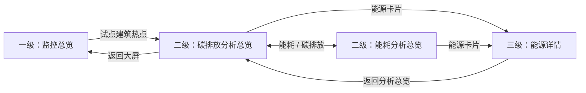

# 建筑能碳监控大屏设计与复用规范

版本：1.0；整理日期：2026-09-14。

定位：将已确认的交互原型沉淀为持续维护的设计入口。本文同时记录原型现状、后续实现要求和未解决事项；不是生产上线、专业核算或标准符合性证明。

## 1. 使用方式与证据边界

本文件适用于产品、设计、前端、后端、能源专家及三维供应方共同评审。新建筑或新版本复用时，先核对第 3 节约束和第 12 节输入，再按稳定模块编号修改，最后执行第 13 节验收。不得直接把示例值、连线、配色或页面名称当作真实设备能力。

依据为本次会话最终确认及独立原型分支 `feature/monitoring-screen-preview` 的源码核查。核查快照为 `00a94cf4d834241147e31f1d0a1563c2ab820e9c`。该分支的原型代码尚未合入主线；本次文档 PR 不引入其页面、图片、构建配置或公共组件改动。下文“原型已实现”仅指该独立候选，不能推断当前主线已具备这些业务页面。

- [项目指南](../../PROJECT_GUIDE.md)：产品定位、稳定架构、真实业务边界。
- [项目状态](../../PROJECT_STATUS.md)：正式基线及各活动候选状态。
- [公共前端实施计划](frontend-visualization-phase-two-implementation-plan.md)：公共外壳、权限与前端演进依据；既有历史内容保持冻结。
- [公开原型](https://building-monitoring-demo.xinzh202691271.chatgpt.site/)：可变的视觉参考，不作为长期验收证据或真实数据来源。

状态术语：**原型已实现**表示固定样本的界面或交互存在；**已确认规则**表示后续应遵循的设计约束；**待确认**表示专业或产品输入不足；**未来方向**表示不属于当前实现的能力。

## 2. 目标、用户与信息层次

目标是在保留建筑场景辨识度的同时，快速回答“总体排放多少、来自哪里、用于哪些分项、与过去相比如何、实测与预测是否偏离、哪些事件或设备需要关注”。适用于桌面演示与监控展示，物理大屏的远距离可读性仍需现场验收。

三个不同维度不得混为一谈：

| 维度 | 定义 | 示例 |
|---|---|---|
| 能源类型 | 排放或用能来源 | 天然气、柴油、外购电力、外购热力 |
| 排放范围 | 碳排放归类边界 | 范围一、范围二 |
| 设备分项 | 用能系统类别，不是具体设备清单 | 空调、照明、消防等九类 |

桑基图的“能源类型 → 设备分项 → 建筑合计”是**图内三层节点**；“监控总览 → 分析总览 → 能源详情”是**页面三级路径**。办公端属于独立工作区，不是监控大屏的二级或三级页面。

## 3. 必须保留的约束与替代关系

| 主题 | 当前规则 | 与早期方案的关系 |
|---|---|---|
| 场景空间 | 背景铺满画布，信息层覆盖；收起不改变背景大小或相机范围 | 保留 |
| 两侧宽度 | 各约 20%，中间约 60% 场景通道；中央仍存在顶部指标和底部卡片覆盖，不能称整块完全无遮挡 | 替代早期各四分之一 |
| 同屏信息 | 左侧三模块、右侧三图同时可见，不再用组标签隐藏内容 | 替代分组切换 |
| 范围一/二 | 同一环图呈现，旁侧列出范围与来源明细 | 替代范围切换和双环图 |
| 能碳流向 | 只保留一张图，默认能流图，可切碳流图 | 明确替代曾经的两图同时展示；这是同屏规则的例外 |
| 桑基结构 | 三层，建筑合计是统计汇总节点，不是新增耗能设备 | 替代两层图和只在底部放总数 |
| 设备分项 | 九类完整列出，名称固定；业务适用性与数据另确认 | 替代“空调、照明、其他”及中间四类方案 |
| 温度 | 室外温度虚线与碳排放实测同图，双轴分别标单位 | 替代上下两张温度/排放图 |
| 预测 | 实测和预测是两个独立序列，全天预测可与已发生实测重叠比较 | 替代截止点后拼接为一条线 |
| 报警/排名 | 底部中央并排，每卡各自向下收起、独立恢复；不随左右隐藏 | 替代两角位置和随侧栏收起 |
| 排名 | 高碳排放强度与低 COP 两榜同时显示 | 替代榜单切换 |
| 品牌/顶栏 | 使用提供的公司 Logo，透明浅蓝薄翼与突出中央标题 | 替代占位 Logo、厚重通栏；不照搬参考品牌 |
| 二三级标题 | 隐藏首页“监控大屏”装饰标题，保留品牌、业务标题和返回层级 | 保留 |
| 首页底部导航 | 不恢复“大屏总览/能耗分析/碳排放分析”底部导航条 | 保留已删除状态 |
| 三维、控制、预测算法 | 三维暂缓；控制不在范围；预测算法未实现 | 未解决或范围外，不因效果图出现而默认启用 |

上述替代仅作用于独立监控页面设计，不覆写平台安全边界，不回写旧设计快照。早期 `2026-09-08-monitoring-screen-panel-design.md` 位于原型分支；其冲突条目应按本表解读，不能继续作为新实现的直接指令。

## 4. 总体布局与视觉复用

```text
┌ 公司标识 / 平台名称 ───── 监控大屏 ───── 时间 / 全屏 ┐
│ 碳排放构成    │  年总量 / 年强度 / 日总量 / 日强度  │ 同期对比 │
│              │                                    │          │
│ 能碳流向     │          建筑场景及入口              │ 排放温度 │
│ 九类三层图   │                                    │          │
│              │                                    │ 实测预测 │
│ 功能碳占比   │   报警信息 ↓     设备排名 ↓          │          │
└──────────────┴──── 各自底边恢复入口 ────────────────┴──────────┘
```

下列是当前候选的逻辑像素，不是所有终端通用的固定字号。目标画布为 1920×1080 等比缩放；未来增加响应式布局必须单独检查信息密度。

| 参数 | 当前候选值或规则 | 复用要求 |
|---|---|---|
| 主顶栏/左右翼 | 60px / 44px；中央标题约 28px | 两侧扁平、中央突出；不得靠加高顶栏压缩场景 |
| 顶部四指标 | 中央区域，左右各留 21%，高 84px；值约 26px | 四项同屏，不扩大为第二个厚横幅 |
| 侧栏 | 各 20%，从指标顶线延至底部 | 增加内容优先重新分配高度，不默认向中央增宽 |
| 左栏高度比例 | 构成 : 能碳流向 : 功能占比约 1.1 : 2 : 0.88 | 九类桑基图获得最大高度，节点名称不重叠 |
| 右栏高度比例 | 对比 : 排放温度 : 实测预测约 1.12 : 1 : 1 | 日期控件、图例、双轴均有独立空间 |
| 卡片间隔/内边距 | 间隔 16px，常规内边距纵 12px、横 16px | 不用缩小到无法识别的字号塞满内容 |
| 底部两卡 | 各宽 24%、高 164px，居中并排、间隔 16px | 不与侧栏重叠，不改变背景容器尺寸 |
| 文案尺度 | 面板标题约 19px，正文约 12–14px，辅助约 10–12px | 当前适用于近距离桌面，现场须复核，不宣称已满足远距离观看 |
| 玻璃面板 | 浅蓝渐变、白色细边、低强度模糊；当前渐变不透明度约 87%–92% | 只调背景透明度，文字/图表不随整卡变淡；明暗建筑背景均须检查 |

首页能源配色：天然气蓝 `#2476ff`、柴油青 `#25bfca`、外购电力橙 `#ffb544`、外购热力浅蓝 `#8bbcff`。范围环图使用独立的范围图例，不能让范围颜色被误认成能源归类。能碳流向后半段使用统一浅蓝灰汇总线。实测用蓝色实线，预测用绿色虚线，室外温度用橙色虚线；必须同时依赖图例和线型，不只依赖颜色。

## 5. 内容与图表目录

### M01 顶栏、M02 关键指标、M03 建筑场景

| 编号 | 内容/图例 | 关键参数及单位 | 当前状态 |
|---|---|---|---|
| M01 | 公司 Logo、建筑能碳监测管理平台、监控大屏、时钟、全屏按钮 | 浏览器全屏；时钟不代表业务数据更新时间 | 原型已实现；天气、消息、搜索等未作为真实能力提供 |
| M02-A | 年累计碳排放总量 | tCO₂，年初至统计截止；示例 1,284.6 | 原型已实现，固定样本 |
| M02-B | 年累计单位面积碳排放强度 | kgCO₂/m²；示例 64.23 | 原型已实现，正式面积版本/边界待确认 |
| M02-C | 当日累计碳排放总量 | tCO₂，当日零点至统计截止；示例 3.82 | 原型已实现，不是瞬时排放率 |
| M02-D | 当日累计单位面积碳排放强度 | kgCO₂/m²；示例 0.191 | 原型已实现，不允许浏览器据示例推导正式面积 |
| M03 | 静态虚构建筑图、试点建筑热点 | 热点进入碳排放分析；底图为 AI 生成静态资源 | 原型已实现；不具备模型、楼层、机组、监测点或真实相机交互 |

### M04 碳排放构成

- 图示：单环图，范围一与范围二两个扇区；中心显示建筑碳排放总量和 tCO₂。
- 旁侧同时显示每个范围的占比、总量及其能源明细。原型范围一为天然气/柴油，范围二为外购电力/外购热力。
- 当前为年累计独立示例：范围一 120.00（95.4 + 24.6），范围二 1,164.60（900 + 264.6），合计 1,284.60；占比 9.34% / 90.66%。范围定义、燃烧源适用性、排除项及真实计量边界须由专家确认。
- 默认不切换范围。环图悬停显示所选范围的数值与单位；旁侧明细常驻。

### M05 能碳流向

- 模块名“能碳流向”，右上为周期；内部按钮“能流图 / 碳流图”，默认能流图。图示三层：**能源类型 → 设备分项 → 建筑合计**。
- 能流图按折标煤 tce 显示，碳流图按 tCO₂ 显示；按钮、标题、合计、节点/连线提示必须一起更新。不得把不同原始单位相加，也不能将 `tce / tCO₂` 写成看似比值的总单位。
- 默认显示能源和分项名称，只有最右建筑合计常驻显示“综合能耗”或“碳排放合计”、数值、单位。删除图底重复合计；不在每条流线或每个节点下默认铺数字。
- 节点悬停显示节点合计，流线悬停显示“来源 → 去向：数值 单位”。流线宽度与同一模式下的数值成比例；不能仅靠宽度跨两种单位比较大小。
- 源到分项按能源着色，分项到建筑合计使用浅色汇总线。右侧合计位于视觉中部，名称不出界、不压线。
- 两段连接是同一份量的分配和汇总；**不得把所有边的值相加**作为总量。每个中间节点的流入＝流出，同一周期/边界的能源合计＝分项合计＝建筑合计。
- 当前有固定两套月度样本，各自合计 100；这不意味着真实碳排放和能耗数值相等，不允许据此推导系数。连线只证明版式和交互，真实供能关系、分配方法、未分配项尚待确认。

### M06 九类设备分项与功能碳排放占比

九类必须完整可见；不得再次缩减为四类或用“其他”替代。图上可使用简称，完整名称用于字段解释、详情和验收。

| 顺序 | 显示名称 | 完整分类名称 | 当前月度碳占比示例 |
|---|---|---|---|
| 1 | 空调 | 空调系统用能 | 40% |
| 2 | 供暖 | 供暖系统用能 | 15% |
| 3 | 通风 | 通风系统用能 | 10% |
| 4 | 给排水 | 给排水系统用能 | 5% |
| 5 | 照明 | 照明系统用电 | 12% |
| 6 | 动力 | 动力系统用电 | 6% |
| 7 | 消防 | 消防系统用能 | 2% |
| 8 | 生活热水 | 生活热水系统用能 | 7% |
| 9 | 炊事 | 炊事系统用能 | 3% |

M06 使用两列小横条，名称和百分比常驻。当前为 2026.08 碳排放分项示例，合计 100%；与 M05 碳流图和分析页的同周期样本一致。此处是碳占比，不随 M05 切到能流图而自动变成能源占比。

分类来自用户提供表格中选定的前九项。表格中过程排放和居住建筑插座用电未纳入本轮界面范围，不能据此宣称九类已覆盖所有建筑或全部标准条款。未配置系统与有系统但无有效数据必须区别呈现，生产状态规则尚待设计。

### M07 碳排放同期对比

- 三根分能源堆叠柱同时展示基期、本期、环比基期；每柱包含四类能源，柱顶显示总量，悬停显示全部分项数值，单位 tCO₂。
- 默认月度示例：去年同月 120、本期 100、上月 110。不能写成“总量柱未按能源分段”；当前已按能源分类展示，仅分项精确数值需悬停。
- 支持日、月、年、自定义区间。同比基期为对应上一年；月环比为上月、日环比为前一日、年环比也为上一年、自定义环比为前一等长区间。年粒度两根基期柱可能相同，不能伪造不同基期。
- 图例/单位/日期范围必须完整。同比、环比变化率目前未直接展示；是否新增常驻变化率待确认，不擅自扩张面板。

### M08 碳排放与室外温度

- 单图双轴：碳排放实线，左轴 tCO₂；室外温度虚线，右轴 ℃。图例明确名称，不能只写“温度”或暗示室内测点。
- 支持独立日、月、年、自定义区间。当前日图为四小时间隔的固定非累计样本；不是总量随时间累加曲线，也不应与顶部日累计样本求和对账。
- 当天两条实测样本均在当前采样点后留空；历史日完整、未来日实测为空。月/年等聚合样本尚未按真实采集截止裁剪，不能当作真实历史结果。
- 基准线是保留的未来需求，当前没有已确认的基准来源，不绘制假基线。温度不是未来实测，更不能隐含生成天气预测。

### M09 碳排放实测与预测

- 独立单图、共享当天 00:00—24:00 横轴和 tCO₂ 纵轴；实测蓝实线，全天预测绿虚线。两条线是不同序列，不在截止点强制接续，不从实测复制出预测。
- 默认今天；仅按日选择。今天实测截至当前时刻之前的四小时采样点，历史日为完整样本，未来日没有实测；预测始终覆盖完整当天。
- 悬停在同一时刻显示实测、预测，二者均有效时显示“偏差（实测−预测）”。缺失值显示缺失，不能填 0 或延续上一个值制造偏差。
- 当前标签“实测截至”指示例采样截止，不是预测算法起算时刻；未来真实预测还需签发时间、模型/输入版本和适用区间。
- 当前只有固定曲线和交互，没有模型服务、自动训练、预测保存或精度验收。

### M10 报警信息与 M11 设备排名

| 模块 | 展示与交互 | 当前边界 |
|---|---|---|
| M10 报警 | 全部/设备掉线/能耗超标筛选及数量；对象、描述、时间；默认两条，查看全部后内部滚动；点击条目展开详情 | 固定三条事件；不是实时告警规则，不包含确认、消警、工单或远程处置 |
| M11 排名 | 高碳排放强度降序与低 COP 升序两榜同时展示；名次、设备、值；各榜独立滚动 | 固定样本、前端样本排序；真实榜单由后端给出，不由浏览器重算 |
| M11 单位 | 强度标“单位待确认”，COP 标“无量纲” | 不从建筑面积强度推断设备强度分母；设备可比性、统计周期和 COP 适用设备待确认 |

两卡各有向下收起按钮；隐藏后在底边保留有文字的恢复入口。收起任何一张不影响另一张、两侧和指标。禁止把底部卡重新绑定到 `leftOpen` / `rightOpen`。

## 6. 独立状态与时间规则

| 操作 | 当前原型结果 | 后续复用约束 |
|---|---|---|
| 首次进入 | 左、右、报警、排名均展开，默认能流图 | 四个可见状态独立 |
| 左右收起/恢复 | 只影响所选侧，边缘保留恢复按钮 | 背景大小稳定；另一侧与底部不受影响 |
| 底部收起/恢复 | 选中卡向下消失，底边恢复；筛选/详情状态保留 | 支持键盘，焦点与动效需可用；尊重减少动画偏好 |
| 能碳切换 | 只改变 M05 模式 | M06 保持碳占比，右侧日期不被重置 |
| 改某图日期 | 仅影响该图 | 不假设跨图联动；共享日期需独立确认 |
| 进入下钻再返回 | 首页保持挂载，恢复面板、日期、筛选及能碳模式 | 不因返回重新初始化首页 |
| 刷新页面 | 原型局部状态恢复默认，路由中分析/能源参数保留 | 不宣称持久化偏好已实现 |

日期控件具备草稿、应用和取消；月/年选择应归一到真实起止日，自定义区间明确起止和长度，处理闰日与跨年。当前所有日期使用固定样本，切换时间只演示日期、轴和粒度，不表示已经查询该日期的真实数据。真实时区、统计截止、日界线、区间开闭、刷新频率和跨年标签可读性需在接入前确认。

## 7. 页面下钻设计



图中三级返回时保留当前能耗/碳排放模式，不强制转为碳模式。办公端不在此路径中。

| 层级 | 目的与布局 | 具体内容 |
|---|---|---|
| 一级 | 场景中心、两侧信息覆盖、底部异常关注 | M01–M11 |
| 二级 | “构成与趋势”独立分析排版，区别于首页和三级 | 左大能源构成环图及四能源图例；右分能源周期趋势（当前为分组柱）、本期/去年同月/上月数值、九类功能分布；底部四张能源卡显示本期值、占比、去年同月、上月及进入详情入口 |
| 三级 | 单一能源深度分析 | 能源名称、能耗/碳排放切换、本期总量及占建筑比例；周期折线、同比/环比两期对比、九类功能分布；返回分析总览及大屏 |

当前二三级为固定示例月份，没有接入任意时间查询。一级热点默认进入碳排放分析；能耗总览可在分析页切换或由分享地址进入。首页没有重新添加底部导航条，也未把所有图表都变成下钻入口。

原型路由约定（是 UI 状态，不是接口）：`#/?analysis=energy`、`#/?analysis=carbon`；三级增加 `source=gas|diesel|electricity|heat`。无效能源标识返回分析总览，无效分析模式回到首页；切换能碳模式可保留有效能源。正式路由、建筑范围、404/无权限交互必须沿平台约束另行接入，不可照搬原型免鉴权入口。

## 8. 数据、单位与专业确认

下表是设计所需的语义信息，不是已批准 DTO、API 或数据库结构。

| 数据组 | 至少需要的语义信息 |
|---|---|
| 共性上下文 | 建筑/对象身份、授权范围、统计起止、时区、截止时间、单位、数据更新时间、质量及缺失状态 |
| 排放总量/强度 | 核算边界、范围、因子及版本、面积/其他分母及版本、精度与舍入、追溯批次 |
| 桑基图 | 节点稳定标识与分类、来源/去向、同一模式单位、量、关系/分配依据版本、未分配或排除项 |
| 对比/趋势 | 基期及本期完整时间区间、粒度、累计或分时含义、可比性、缺失点与质量 |
| 预测 | 对象、预测值与实测独立时间序列、签发时刻、预测覆盖区间、模型/输入版本、偏差定义 |
| 报警/排名 | 事件状态、发生/恢复时间、阈值依据、可见范围；排名周期、有效质量、可比设备集合、排序方向、单位 |

强度面积含义沿用整栋建筑总建筑面积的展示意图，但正式面积定义和版本须专家确认。九类分项是界面目录，不意味着全部系统已有测点。固定样本的来源与分配不具有现场证据，尤其不能将柴油、消防、动力之间的示意连线直接转成供能规则。

后端计算并提供权威指标、关系与排名；前端负责展示、选择和交互。Q0/Q1/Q2 的采用规则按场景配置并追溯，不能统一硬编码。无数据、无权限、未配置、不适用、异常、零值应可区分；具体业务空态目前未完整实现。不得以前端补算、随机数据或补点掩盖后端问题。

## 9. 原型与正式系统的复用边界

原型分支代码位置供追溯，当前主线不含这些文件；若要运行原型，应先选择含该候选的分支。这里不提供指向主线不存在文件的本地链接。

| 原型相对位置 | 已核查职责 | 正式复用方式 |
|---|---|---|
| `web/prototypes/monitoring/Page.vue` | 首页浮卡、独立隐藏、时间控件、切换 | 迁移布局与交互，不迁入固定业务样本 |
| `chart-options.ts` / `periods.ts` | 图表选项、时间标签及基期计算 | 保留语义要求；专业聚合归后端，真实时间语义重新验收 |
| `Surface.vue` / `CompositionOverview.vue` / `AnalysisPage.vue` | 一级保持状态、二三级路由与差异化布局 | 通过正式模块路由与授权接入 |
| `messages.ts` / `tokens.css` / `App.vue` | 文案、视觉变量、原型皮肤 | 纳入现有模块语言与 Token 边界，不复制一套公共主题 |
| `fixtures.ts` / `analysis-fixtures.ts` | 固定数据和关系样本 | 仅用于隔离测试或原型，不进入生产数据链路 |
| `Page.test.ts` / `AnalysisPage.test.ts` | 切换、状态、汇总、下钻契约检查 | 按迁移范围转成真实模块测试，补异常和权限用例 |
| `web/scripts/verify-monitoring-prototype.mjs` | 三个桌面尺寸、隐藏、日期、下钻、无业务请求检查 | 保留场景清单；不能替代真实后端或三维验收 |

正式页面继续复用现有监控外壳、逻辑画布、图表生命周期、Element Plus/Lucide 与统一图表入口。保持“页面/组件 → 状态编排 → API Client/契约 → 后端服务”职责；本文不新增 API、数据库或架构分层。原型部署可公开演示不等于生产平台应公开免鉴权。

## 10. 未来方向与进入条件

| 编号 | 方向 | 进入条件 | 可验证结果 |
|---|---|---|---|
| F01 | 专业口径与输入冻结 | 专家确认能源、九类分项、计量/排放边界、单位、面积、因子、供能关系和质量策略 | 明确样例能按来源、分项、总量对账；未分配项不被静默丢弃 |
| F02 | 正式模块与可信数据接入 | 接口契约、权限、数据质量与字段映射评审；保留当前布局和控制禁区 | 真实加载/空/错误/越权状态；刷新可追溯；无前端伪造指标 |
| F03 | 时间与对比深化 | 完整历史查询、聚合定义、可比周期、闰日/跨年规则 | 同环比基期可解释；跨图联动和变化率是否新增单独批准 |
| F04 | 基准与预测分析 | 明确基准来源、预测任务、模型与输入版本、保存方式和评估标准 | 实测/预测可同时间对比；无未来实测伪装；精度验收独立于画面验收 |
| F05 | 真实报警与设备排名 | 阈值、状态生命周期、可比设备、周期、强度分母、COP 定义确认 | 异常可追溯，事件和榜单权限隔离；智能分析仅为另行评审方向 |
| F06 | 三维对象及空间联动 | 用户重新启动三维范围，提供模型、楼层/空间/设备/测点映射和模型供应方案 | 建筑分层监测点、机组碳排热力分布、可量化指标与下钻；场景不被 UI 遮挡 |
| F07 | 交付与场景验收 | 专用虚拟数据、真实授权及必要的现场输入 | 桌面/物理大屏、长时驻屏、刷新/重连、性能和可读性分别有证据 |

F01–F07 是后续规划，不代表相关系统或模型已完成。先专业输入与可信数据，再迁移可视化和开展虚拟/现场验证；不因原型漂亮而跳过阶段边界。当前暂不新增三维内容；不包含远程控制、指令下发、策略生成/下发、响应执行。预测展示原型不等于批准实施平台暂缓的负荷预测服务。

## 11. 当前差距清单

- 原型与正式主线隔离，生产鉴权、真实数据接口、业务质量和异常状态未完成端到端接入。
- 样本日期切换不查询真实历史；二三级固定月份；当前月/年未来点、跨年短标签和真实采样频率需再次设计。
- 基准线、同环比变化率常驻展示、真实模型预测尚未实现或未确认。
- 设备强度单位、COP 适用对象与可比设备集合未冻结。
- 首页能源颜色已明确；二三级图表部分使用图表默认色，跨层颜色完全一致仍是后续验收项，不能宣称已完成全局统一。
- 侧栏字号在等比缩小时变小；九类图表虽已排版，物理大屏观看距离、极长名称和大数据规模仍未验收。
- 真实三维、监测点、分层与热力分布未实现；生成图上的供能连线不能用于工程验收。

## 12. 新项目/新建筑复用输入清单

1. **身份与场景**：项目/建筑名称、正版 Logo、用户角色、目标分辨率、观看距离、浏览器及全屏要求。
2. **统计边界**：能源适用清单、九类分项适用性、范围一/二、遗漏或未分配项、建筑面积与版本。
3. **专业依据**：折标参数、因子、单位精度、时间粒度、质量采用、排名和报警规则；不得直接沿用演示值。
4. **关系输入**：表计与设备、系统和空间关系，能源到设备分项的真实映射、分摊规则及生效时间。
5. **服务能力**：指标/趋势/对比/事件/排名/预测的实际可用性、身份授权、刷新和降级方式。
6. **素材与三维**：静态还是三维、素材权利、对象标识映射及性能预算；三维未启动时仅替换合法静态场景。
7. **验收范围**：哪些仅做原型，哪些接真实数据，哪些开展物理屏或现场验收；分别记录证据。

缺少专业输入的条目标为待确认，不用默认值冒充已配置。发现不同建筑需要新增分类或改变边界，应更新受影响模块和关系版本，不只改 UI 名称。

## 13. 可复用验收清单

| 编号 | 验收项 | 通过标准 |
|---|---|---|
| A01 | 默认完整性 | M01–M11 可见；四指标、九类分项及对应单位无遗漏，无文本/图例溢出 |
| A02 | 空间与比例 | 1920×1080、1440×900、1366×768 核对；两侧约 20%，底部居中不相交；收起前后场景尺寸一致 |
| A03 | 四组独立隐藏 | 分别收起左右、报警、排名及组合，互不影响；恢复入口可见，状态保留 |
| A04 | 单图切换 | 默认能流，切碳流后仅一图存在，单位、合计、提示同步；九类分项完整 |
| A05 | 数字显隐 | 常态只有建筑合计显示数值；节点和线悬停明细正确；没有重复底部总数 |
| A06 | 汇总守恒 | 每个源合计正确、每个中间节点流入＝流出、终点等于总量；不跨单位或累计两段重复计数 |
| A07 | 构成/占比 | 范围环图和来源合计正确；同周期分项占比与碳流图一致；不同周期明确区分 |
| A08 | 时间边界 | 应用/取消、闰日、跨年、月末、自定义等长基期及独立日期状态正确；无效区间不提交 |
| A09 | 实测与预测 | 同轴独立两线、全天预测、实测截止、缺失不伪填；温度在右轴且不冒充未来实测 |
| A10 | 报警/排名 | 类型计数与筛选一致、详情可读、列表内部滚动；双榜排序与单位正确，隐藏后恢复筛选 |
| A11 | 下钻与返回 | 二三级明显不同；四能源均可进详情、切模式及返回；地址直达、无效参数、浏览器返回可解释 |
| A12 | 专业与生产状态 | 区分零/缺失/不适用/无权限；单位、版本、截止可追溯；服务失败不伪造结果；正式接入后单独验收 |
| A13 | 可访问与持久运行 | 键盘可用、恢复后焦点合理、减少动画、图表销毁/重建、长时驻屏和目标物理屏效果有证据 |

截至本次整理，源码与既有测试覆盖了样本守恒、切换、日期、独立隐藏及下钻等原型行为。此前候选曾完成桌面浏览器检查；**本次为文档核查，没有重跑运行测试**，不以历史记录作为本 PR 的运行验收。A12、物理屏/长时及真实三维相关检查仍未验证。完整验收应按 [仓库流程](../development/repository-guardrails.md)和实际变更风险执行，不以纯文档检查替代业务验收。

## 14. 后续维护规则

- Mxx、Fxx、Axx 为稳定引用编号；在任务和 PR 中写清涉及哪些编号，未受影响规则继续保留。
- 普通改动更新相关段落与差距清单；不要为每次间距调整复制一份设计。大版本或重大架构变化才建立新的正式设计/ADR，并记录替代关系。
- 每次内容变化同时检查图名、图例、单位、周期、边界、默认/悬停状态、入口/返回、独立隐藏、缺失态及跨图一致性。
- 视觉参考或生成效果图不自动改变专业规则；以确认的文字、真实关系和验收样例约束实现。
- 变更实现状态只更新有证据的部分，项目状态保持正式基线与活动候选分离；历史设计不回写。
- 本文不长期记录端口、账号、临时路径、凭据或固定测试数量。后续不能只因文档已合并就标记界面或业务已完成。

| 文档版本 | 变化 |
|---|---|
| 1.0 | 整理当前原型的模块、九类三层流向、独立隐藏、二三级分析、旧约束替代关系及未来进入条件；与生产能力明确分离 |
